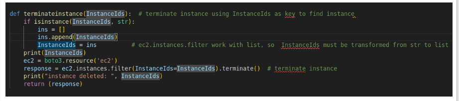

"Задача  №10 написать на питоне скрипт для создание машины. далее питоном получить всю инфу про машину (ip,os,metrics,size + type) сменить ключ от него и потом все убить кодом на питоне. 
Сделать еще один скрипт (bash) на установку aws cli который сам поймет какая операционка. после установки разобраться с кредами и сделать профиль. По умолчанию ОС читает ТОЛЬКО баш скрипты. Т.е. нет питона и др. языков программирования. Стоит исползовать нативные пакетные менеджеры ОС. Скрипт должен отрабатывать под Redhat, Ubuntu, MacOS, Windows (+ другие по желанию) 
*Сбор метрик работает после отработки основного скрипта, так что нужно что бы отработал один скрипт, затем отдельный скрипт на сбор метрик 
Дедлайн 2 день"
***

### написать на питоне скрипт для создание машины. далее питоном получить всю инфу про машину (ip,os,metrics,size + type) сменить ключ от него и потом все убить кодом на питоне. 

### Импортирую библиотеки

### Определяю переменнные

### Функция для создание одного instance с операционной системой ubuntu, user ubuntu и именем myname
### Функция возвращает ec2.Instance(id='i-*****') класс инстанса который был создан

### Вызываю функцию которая создает инстанс, получаю ec2.Instance класс, из него получаю InstanceId
### по InstanceIds получаю PublicIpAddress инстанса

### Функция для получения метрик через ssh подключения и вызова утилит bash

### Функция для подмены публичного ключа

###  Функция для удаления инстанса по InstanceIds

### После вызова функции на создание инстанса жду 30 секунд

### Затем получаю метрики, меняю ключ, удаляю инстанс

### Результат выполнения скрипта 

## [Скрипт для создание и удаления инстанса](create_instance.py)
***

### Сделать еще один скрипт (bash) на установку aws cli который сам поймет какая операционка. после установки разобраться с кредами и сделать профиль.

### Получаю данные о инстансах

### В зависимости от типа инстанса выполняю разные скрипты на установку aws cli

### Передаю config и credentials файлы для aws cli

## [Скрипт для устновки aws cli на инстанс ](install_aws_cli.py)

## [deb_ubuntu.sh ](deb_ubuntu.sh)
## [redhat.sh ](redhat.sh)
## [macOS.sh ](macOS.sh)
## [win.sh ](win.sh)

### power.ps1

