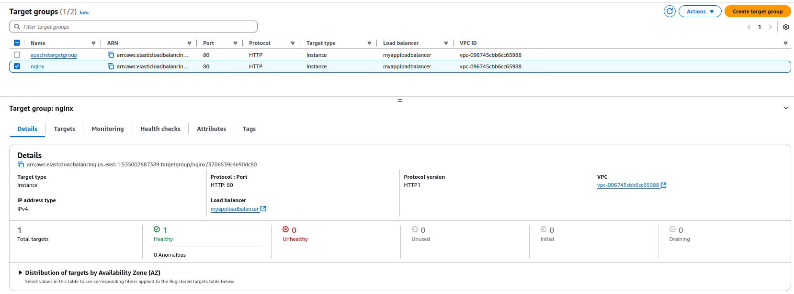

"Задача  №11 Задача на Application Load Balancer и домены

Практическая часть:
Нужно создать инстанс с nginx который работает на порту 80 или 443 отдает вашу кастомную вебстраничку.
Нужно создать инстанс с apache. который работает на порту 80 или 443 отдает вашу кастомную вебстраничку.
https://www.dynu.com/
https://www.noip.com/ нужно создать несколько записей у выбранного домена. Это будет иметь вид nginx.example.com и apache.example.com
*Под example.com понимается ваш купленный домен.

Нужно создать Application Load Balancer который разводит трафик в зависимости от того на какой хост приходит запрос. 
Если мы вводим в адресную строку браузера nginx.example.com то попадаем на наш инстанс с кастомной веб страничкой.
Если мы вводим в адресную строку браузера apache.example.com то попадаем на наш инстанс с кастомной веб страничкой.
Если мы вводим в адресную строку браузера google.example.com то попадаем на стартовую страницу поиска Гугл
Дедлайн 2 дня"

***
### Нужно создать инстанс с nginx который работает на порту 80 или 443 отдает вашу кастомную вебстраничку.

### Нужно создать инстанс с apache. который работает на порту 80 или 443 отдает вашу кастомную вебстраничку.

### https://www.dynu.com/ https://www.noip.com/ нужно создать несколько записей у выбранного домена. Это будет иметь вид nginx.example.com и apache.example.com *Под example.com понимается ваш купленный домен.

### Нужно создать Application Load Balancer который разводит трафик в зависимости от того на какой хост приходит запрос. 
Если мы вводим в адресную строку браузера nginx.example.com то попадаем на наш инстанс с кастомной веб страничкой.
Если мы вводим в адресную строку браузера apache.example.com то попадаем на наш инстанс с кастомной веб страничкой.
Если мы вводим в адресную строку браузера google.example.com то попадаем на стартовую страницу поиска Гугл

### Создаю CNAME records для Application Load Balancer

### Создаю target groups

### Создаю rules для Listener

### Routing выполняется по Host header

### Default rule

## [Default rule](http://myapploadbalancer-1118112336.us-east-1.elb.amazonaws.com/)

###  rule nginx.trainree4.com

## [rule if nginx.trainree4.com](http://nginx.trainee4.com/)

###  rule apache.trainree4.com

## [rule if apache.trainree4.com](http://apache.trainee4.com/)

###  rule google.trainree4.com

## [rule if google.trainree4.com](http://google.trainee4.com/)

