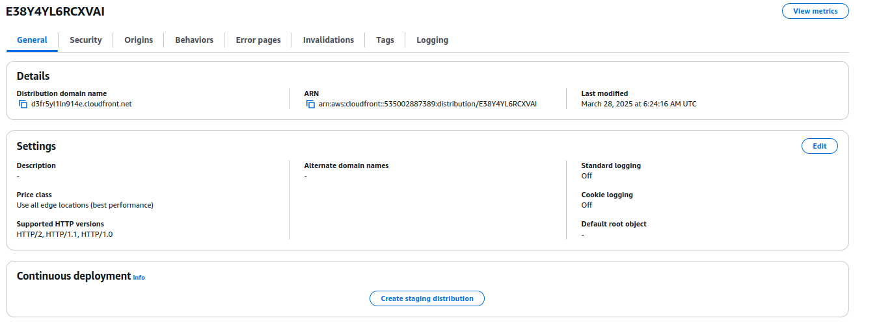

"Задача  №12 [FRONTEND] Задача по AWS S3+CloudFront :  Взять простую html,(можно из прошлых заданий) залить на с3 бакет и сделать Static website hosting, после этого залить его на клаудфронт. (2 дня)
+ нарисовать диаграмму AWS с помощщью draw.io"

***

### Создаю S3 Bucket 

### Добавляю html страницу

### Делаю Static website hosting

### Добавляю Bucket Policy на чтения файлов в bucket

### Страница доступна по адресу:

## [S3 Bucket website](http://mystaticsitetrainee4.s3-website-us-east-1.amazonaws.com/)

***

### Создаю CloudFront Distributions

### Страница из S3 Bucket доступна по адресу CloudFront:

## [Cloud Front link for S3 Bucket website](https://d3fr5yl1ln914e.cloudfront.net/)

### + нарисовать диаграмму AWS с помощщью draw.io"

## [Draw.io file](S3BucketCloudFront.drawio)

***

