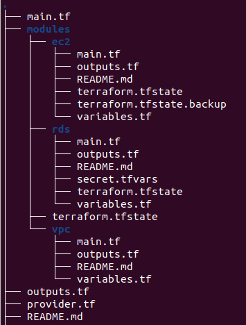

"Задача  №13 Задача с терраформом: 
Поднять в terraform aws следующее : весь VPC(как в задаче с aws vpc),  2 server( Bastion host + private) + Security groups + RDS + multiAZ для впс. нужно чтобы они были в 
отдельных модулях, изучить как оно взаимодействует между собой в модулях с применением variables.tf и output.tf .
Дедлайн 4 дня"
***
### Проверяю что terraform и aws cli устнановлены и настроены ключи
 

### Указываю тип провойдера и его версию в provider.tf 

### Создаю католог проекта и выполюняю terraform init для проекта и для модулей

### В модуле vpc описано создание виртуальной сети и двух подсетей в этой сети, одна подсеть публичная вторая приватная. Создаются internet gateway и nat gateway, route tables и security rule для ssh трафика. 

## [/module/vpc/main.tf](../modules/vpc/main.tf)
## В variable.tf определяются переменные используемные в модуле.
## [/module/vpc/variables.tf](../modules/vpc/variables.tf)
## В outputs.tf определяются параметры передоваемые в другие модули либо выводимые на экран.
## [/module/vpc/outputs.tf](../modules/vpc/outputs.tf)

###   Модуль ec2 испоьзуется для создание двух инстансов(бастион и приватный инстанс). Бастион расположен в публичной подсети, приватный инстанс в приватной подсети.
## [/module/ec2/main.tf](../modules/ec2/main.tf)
## [/module/ec2/variables.tf](../modules/ec2/variables.tf)
## [/module/ec2/outputs.tf](../modules/ec2/outputs.tf)

### Модуль rds создает один инстанс базы данных PostgresQL в Multi-AZ. 
## [/module/rds/main.tf](../modules/rds/main.tf)
## [/module/rds/variables.tf](../modules/rds/variables.tf)
## [/module/rds/outputs.tf](../modules/rds/outputs.tf)
### Структура ec2 и rds модулей анологична модулю vpc. 

### Коренвой модуль находится в корневой папке проекта и не иммет отдельного названия. Из корнего main.tf вызываются остальные модули для создание инфроструктура. 

### Как упоминалось выше модули имеют outputs.tf файлы с набором параметров, благодоря данную механизму осуществляется передача данных о созданных подсетях и security group из модуля vpc модули private_ec2 и public_ec2. 
## [main.tf](../main.tf)
## [variables.tf](../variables.tf)
## [outputs.tf](../outputs.tf)

###   Результаты выполнени terraform apply

