Задача №14 создать image (поднять nginx используя конфигурации из предыдущих заданий (проксипасс, редирект, картинки, музыка) ) в docker c использованием Alpine images, что бы всё работало из контейнера. Сделать вариант как с докерфайлом так и с докер-композом. Также создать аккаунт на докерхабе и добавить свои образы туда (Дедлайн 5 дней)

### Для создание nginx docker image использую следующую папку html где хранятся данные. В docker image папке будет распологаться по в /var/www/html

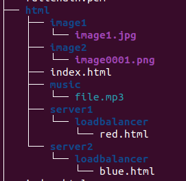

### Использую следующий файл конфигурации nginx.conf 

## [nginx.conf](nginx.conf)

### Использую  файлs ssl certificate:  fullchain.pem и privkey.pem которые будут находиться в docker image в папке /etc/letsencrypt/live/trainee4.com

### Dockerfile имеет следующие вид: 

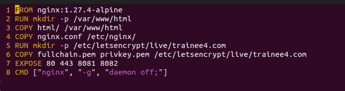

### Первая строка указывает на базовый image который используется при создание кастомного image. В данном случае это nginx:1.27.4-alpine. В второй строке с помощью команы RUN запускаю sh команду mkdir -p /var/www/html которая создает дерево папок. Затем копирую папку html находящуюся на локальком компьютере в папку докер образа. В 4-ой строке копирую файл конфигурации nginx.conf в папку /etc/nginx докер обрза. В 5 и 6 строках создаю папку для файлов ssl сертификатов и копирую туда файлы с локальной машины. Командой EXPOSE указываю какие порты нужны кастомному nginx для работы. Командой CMD запускаю nginx с параметром -g "daemon off;" Что позволяет получить вывод access.log в терминал.

## [Dockerfile](Dockerfile)
### Затем выполняя docker build . -t myimage:0.4
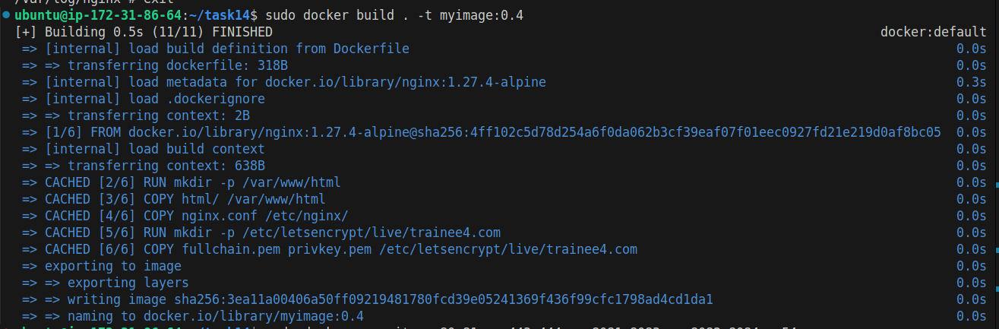
### и запускаю контайнер 
### docker run -it -p 80:80 -p 443:443 -p 8081:8081 -p 8082:8082  myimage:0.4
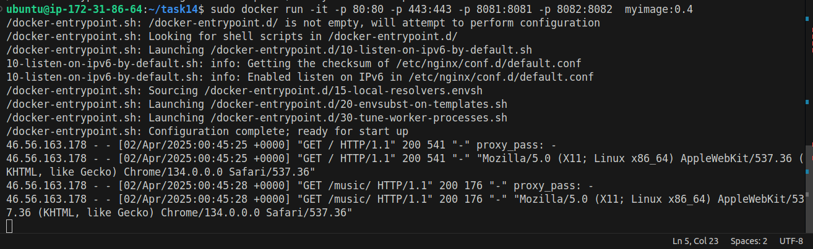

### Вариант c docker-compose. 
### Создаю файл compose.yml 
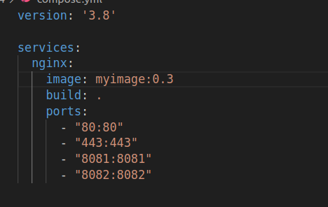
### Выполняю файл командой docker-compose up --build, которая создает образ из докер файла и запускает контейнер из образа 
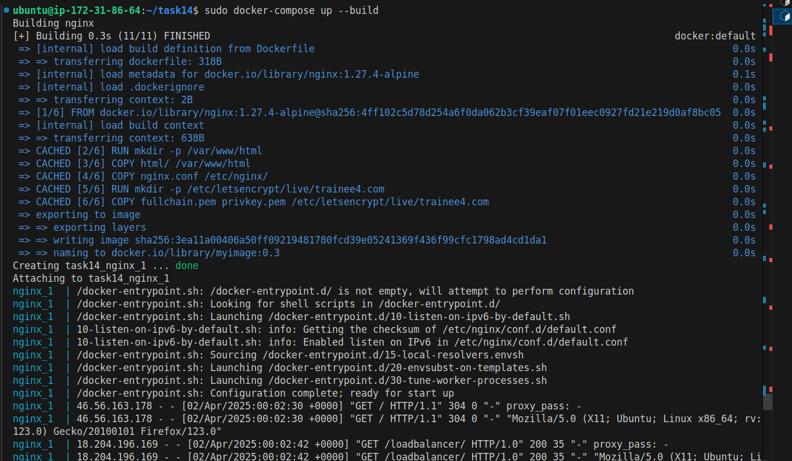

## [Ссылка на сайт](https://www.trainee4.com/)

### Создаю аккаунт на докер хабе

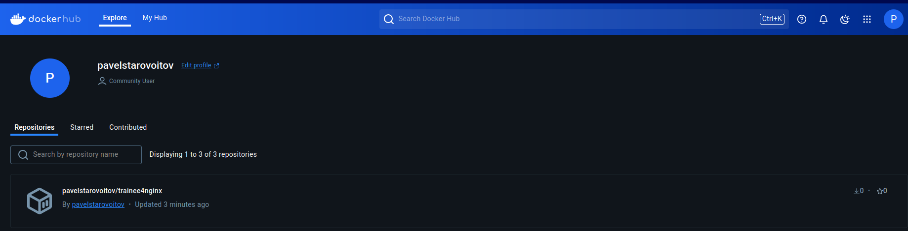
### Cоздаю обзар с провильным именем 
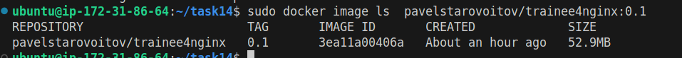
### Создаю token доступа
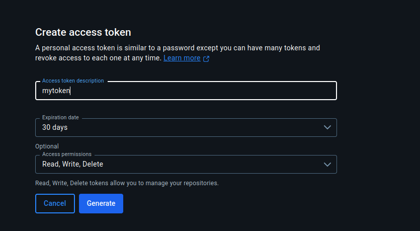
###  Добовляю токен
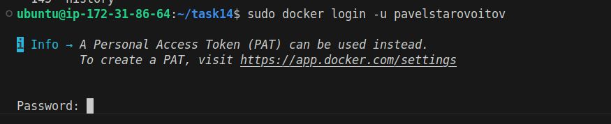
### Выполняю команду docker push <myregistry>/<myimage>:<tag>

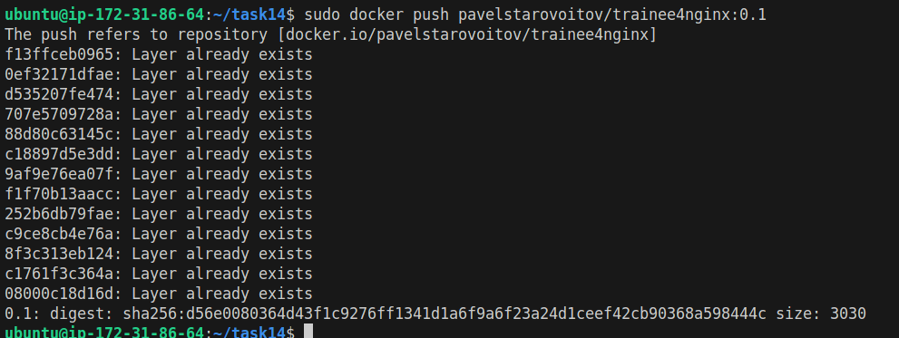

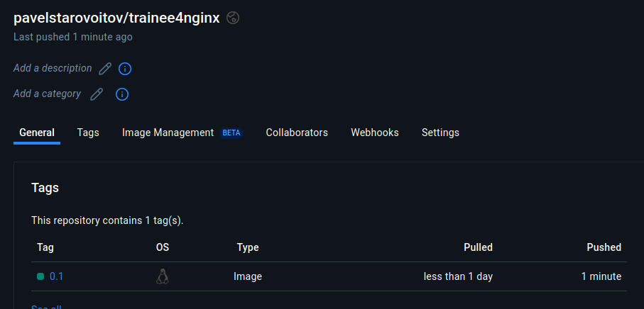

## Команда для получения образа из repository

## *docker pull pavelstarovoitov/trainee4nginx:0.1*  

