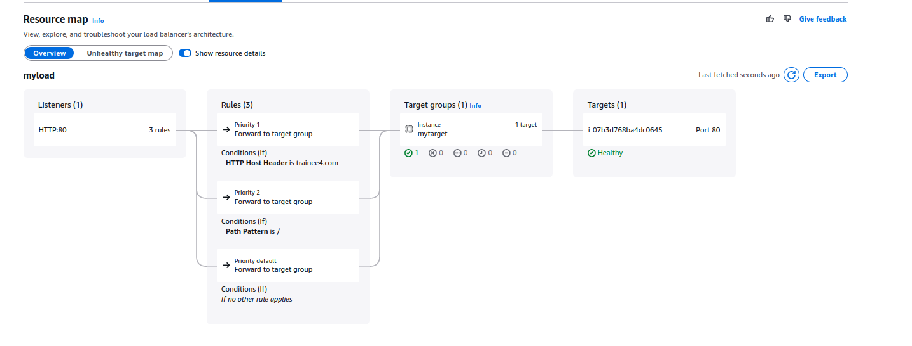

Задача  №15 ECS:  перенести структуру докера в ecs. в ec2 и в fargate. Тип не таск, а сервис. + Подвязать application load balancer Дедлайн 2 дня

### Создаю fargete cluster

### Создаю task definition для fargete cluster

### Создаю Serivce использую созданную task 

### Проверяю запущенну taks

### Создаю EC2 cluster

### Создаю task definition для EC2 cluster

### Создаю Service для EC2 cluster

### Проверяю запущенну taks для EC2 cluster

## + Подвязать application load balancer

### Создаю Service для EC Cluster c load balancer

### Создаю Service для fargete c load balancer

