"Задача  №16 по git (Д):
""пункт 1""
Надо взять уже имеющейся проект, залить его в гитхаб. Залить в ветку master(main), создать ветку develop, внести изменение в файлы в develop и сделать pull request(merge request) в master(main). 
Подключение к гиту должно быть с помощью ssh-key. Все изменения производить в консоле. На чеке от ментора показать откат коммита в дев ветке и так же сделать pull request(merge request).
""пункт 2"":
Подолжая работу с проектом создать 5 коммитов в develop ветке, и в ветку prod записать только 1-й,3-й,5-й коммиты, которые были сделаны в develop
Дедлайн 1 день""

##""пункт 1""
### Иницилизирую локальный  git репозиторий с веткой main. 
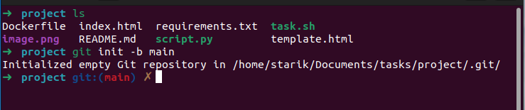

### Делаю init commit  
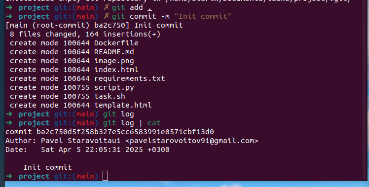

### Добавлюя ssh ключ на github аккаунт

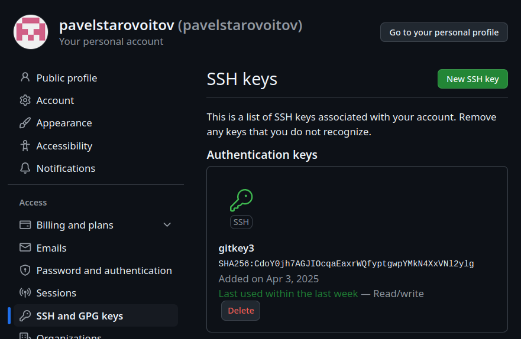

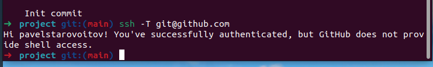

### Устанавливаю gh 
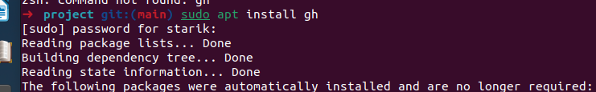

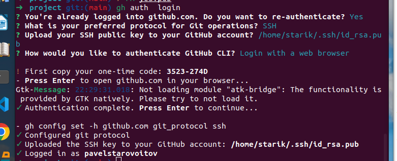

### Создаю репозиторий на github

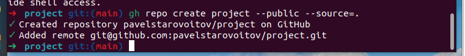

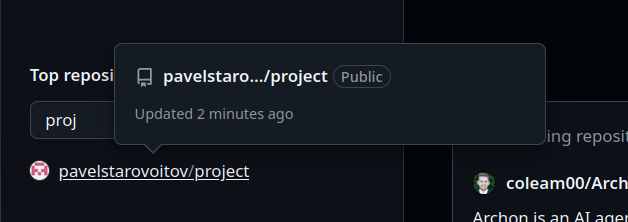

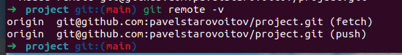

### Копирую файлы из локального репозитория на github в ветку main

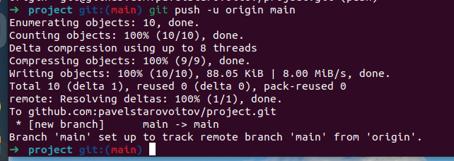

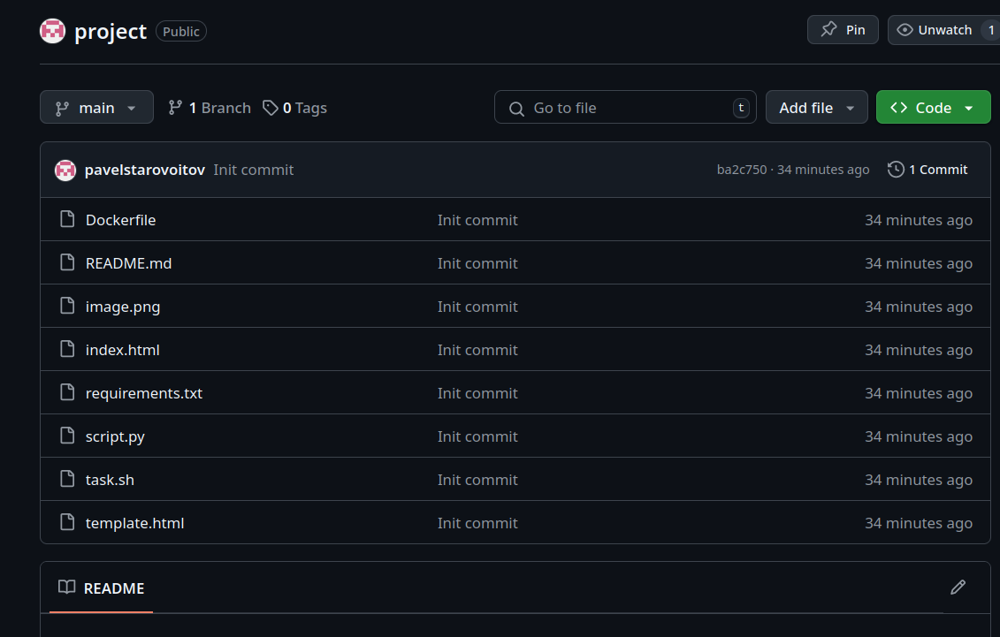

### Создаю ветку develop 

### Вношу изменения в файл README.md

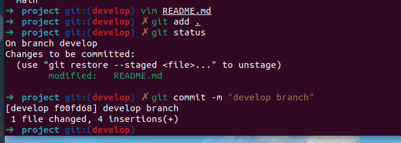

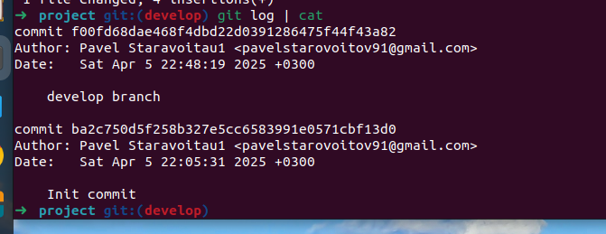
### Добавляю ветку develop на github

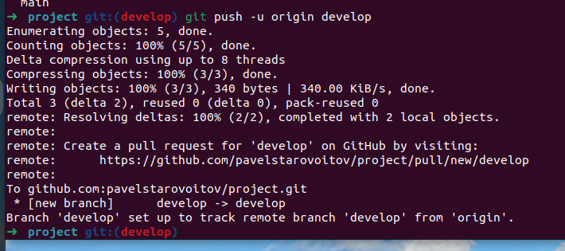

### Создаю merge requst

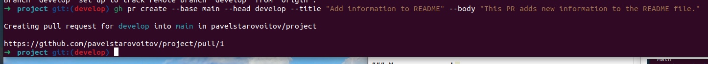

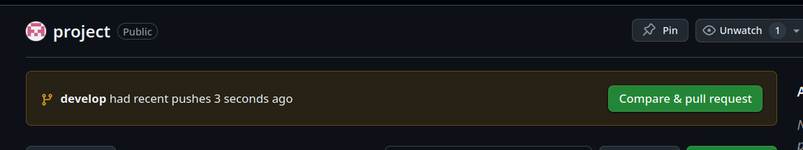

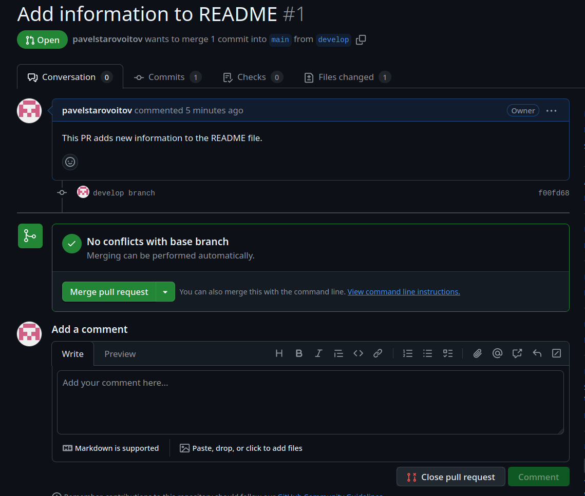

***
## ""пункт 2""
### Cоздаю 5 коммитов в develop ветке

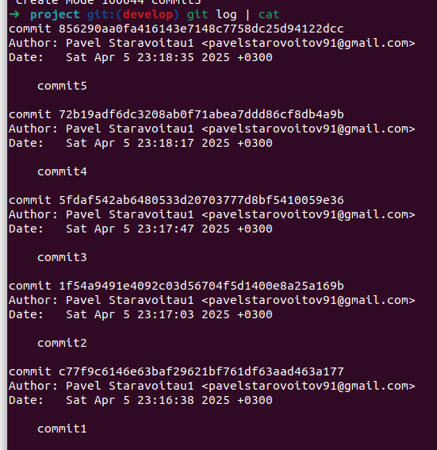

### Cоздаю ветку prod

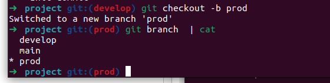

### C помощью команды git rebase -i оставляю только 1-й, 3-й и 5-й коммиты

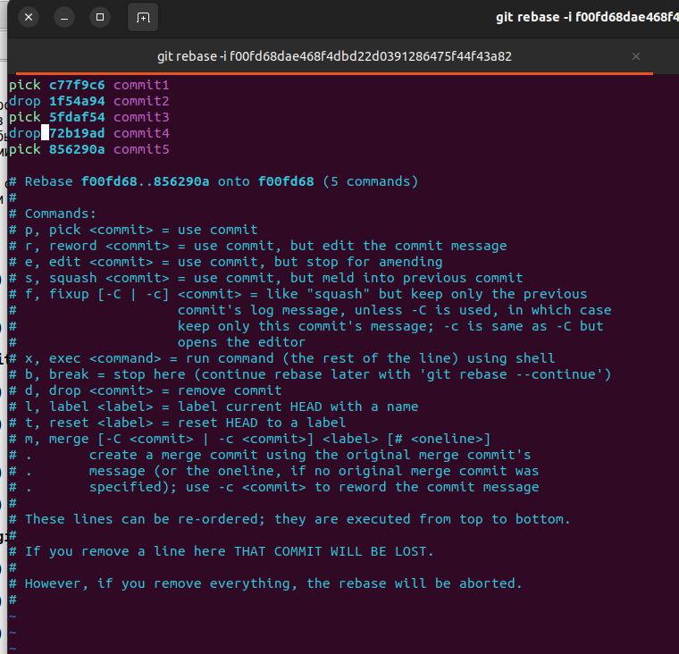

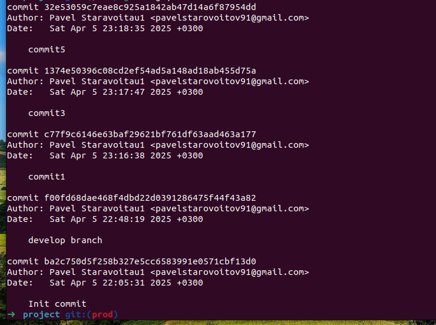

### Копирую ветку prod на github

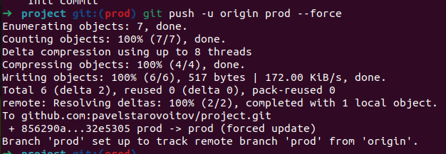

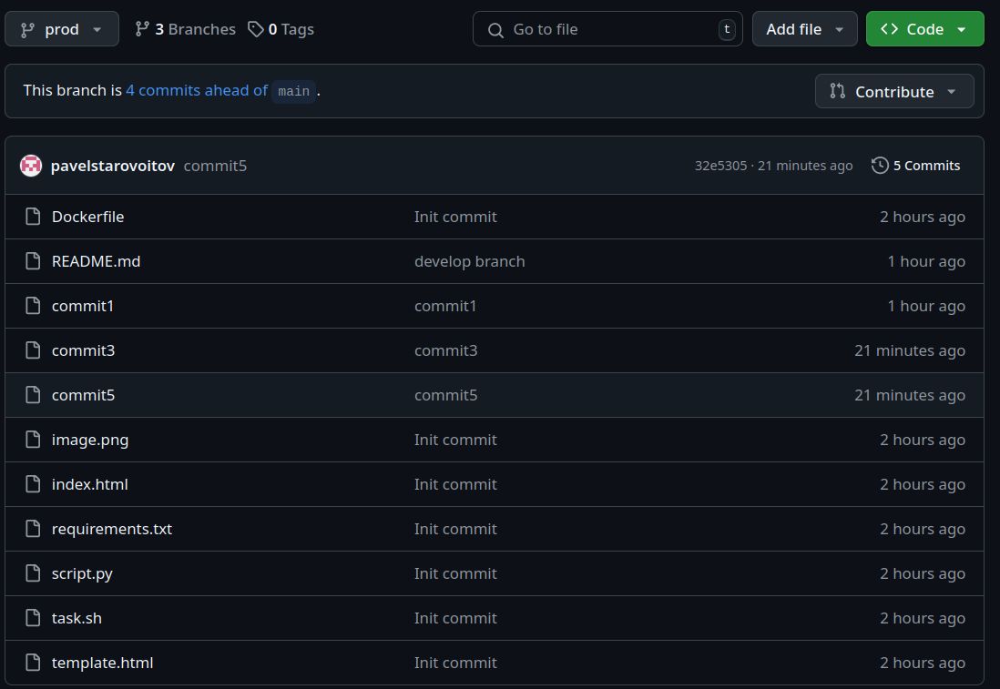

## [Cсылка на репозиторий в github](https://github.com/pavelstarovoitov/project/tree/develop)

