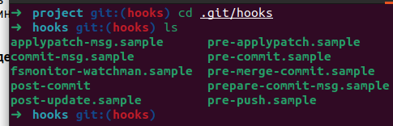
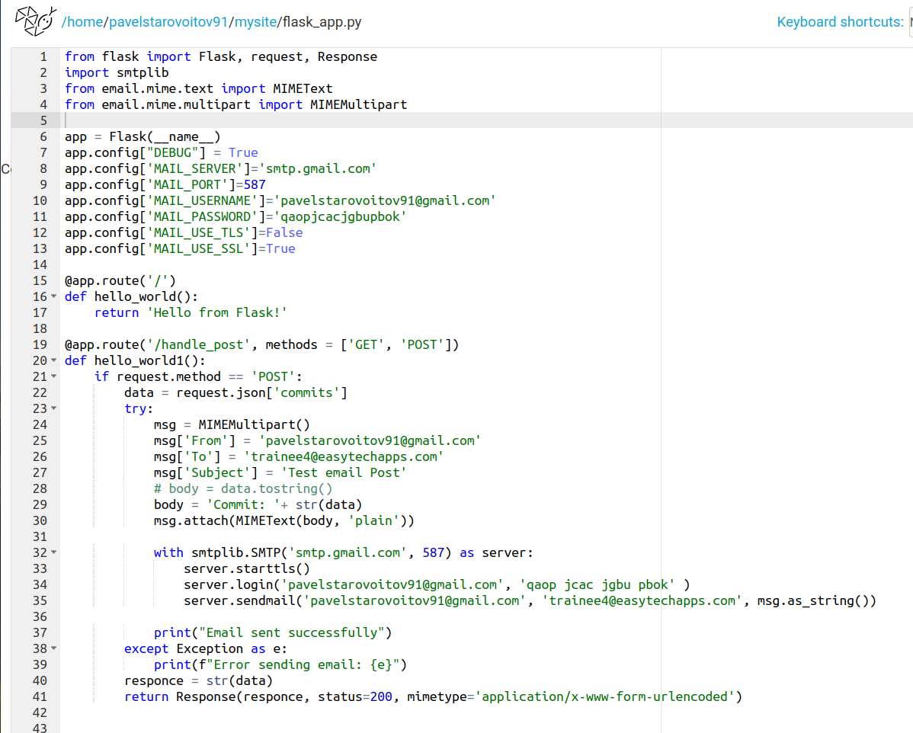
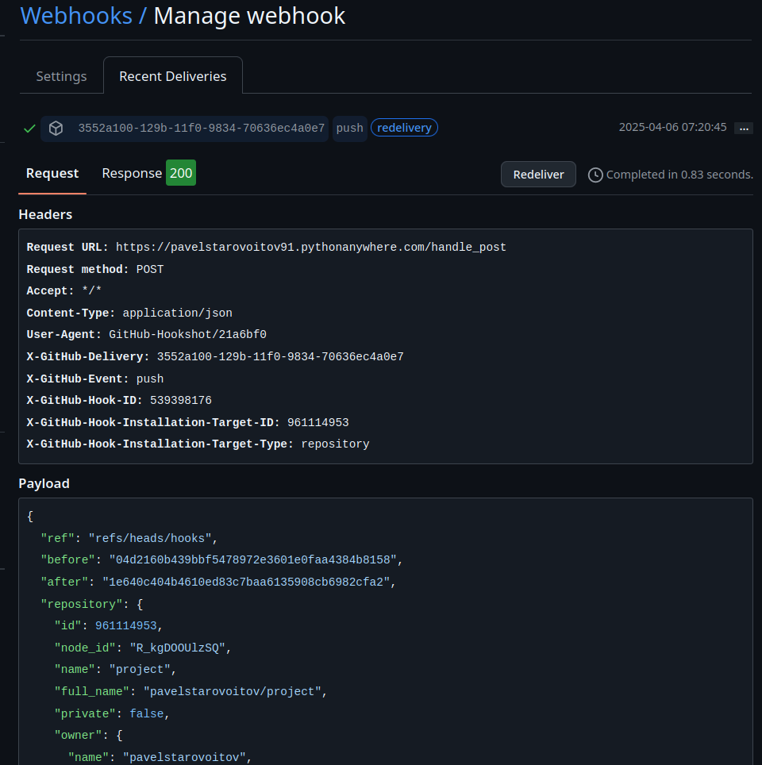
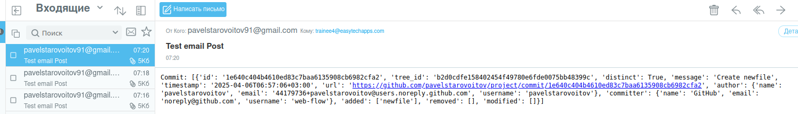

"Задача  №17 по git (Д):
На основе преведущего задания настроить git hooks так что бы в случае коммита, будет отправленно письмо на электронную почту. *Чтобы принимать на gmail с github надо 2х факторная аутентификация
Дедлайн 1 день"

### Создаю ветку hooks в которой буду делать тестовые коммиты для отравки писем на почту

### В папке локального репозитория в .git/hooks создаю post-commit 

### В google.com получаю password для приложения

### Создаю скрипт на python для оправки сообщений 

## [sender.py](sender.py)
## [.env file](.env)

### Добавляю вызов python скрипта в .git/hooks/post-commit

## [post-commit](post-commit)

### Создаю GitHub Webhooks

### Создаю python flask скрипт на https://www.pythonanywhere.com/ чтобы получить url

## [pythonanywhere flask script](https://www.pythonanywhere.com/user/pavelstarovoitov91/shares/675e0480bce947ddb032b952be4aa5d1/)

