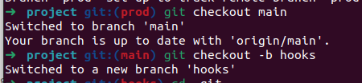
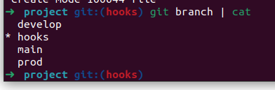
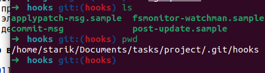
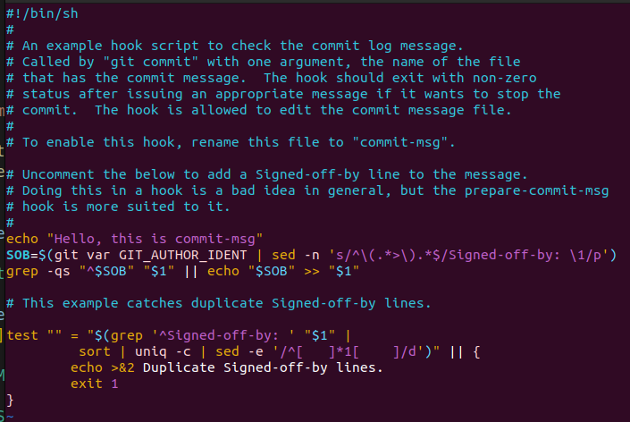
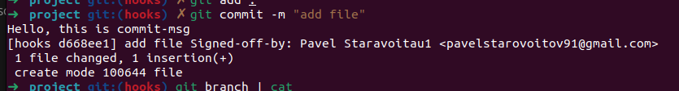
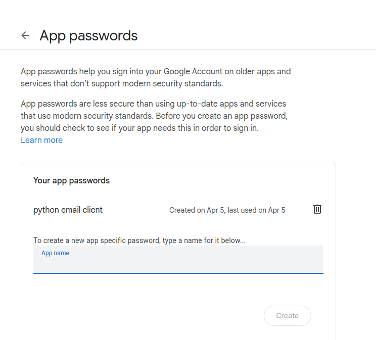
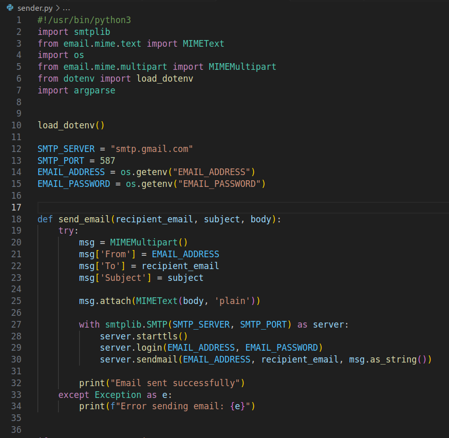
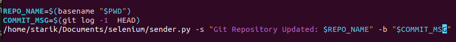
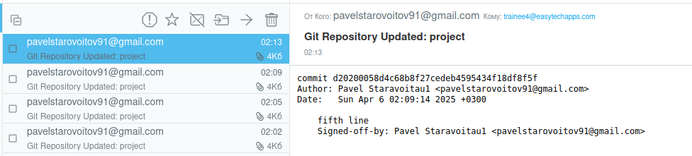

"Задача  №17 по git (Д):
На основе преведущего задания настроить git hooks так что бы в случае коммита, будет отправленно письмо на электронную почту. *Чтобы принимать на gmail с github надо 2х факторная аутентификация
Дедлайн 1 день"

### Создаю ветку hooks в которой буду делать тестовые коммиты для отравки писем на почту

### Папке локального репозитория в .git/hooks переименоваю commit-msg.sample в commit-msg

### Редоктирую commit-msg скрипт

### Теперь при выполнении git commit появляется измененное сообщение

### В google.com получаю password для приложения

### Создаю скрипт на python для оправки сообщений 

## [sender.py](sender.py)
## [.env file](.env)

### Добавляю вызов python скрипта в .git/hooks/commit-msg

## [commit-msg](commit-msg)

