Задача  №18 Нужно поставить контейнеры докер которые уже имеются но на 2 сервера, и чтобы контейнеры поднимались с помощью Ansible. То есть у нас будет мастер машина которая раскидывает на 2 машины( ubuntu и amazon linux) файлы или подтягивает с гита и делает развёртку, через playbook с ролями и условиями, например установка отличается если разные пакетные менеджеры (Дедлайн 2 дня)

### Устанавливаю ansible на локальную машину (мастер машина)

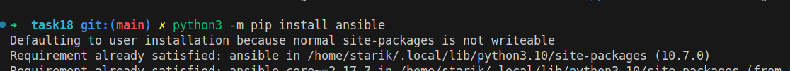

### Создаю два EC2 инстанса один с ubuntu, второй с amazon linux
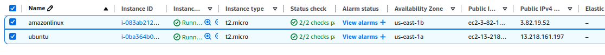
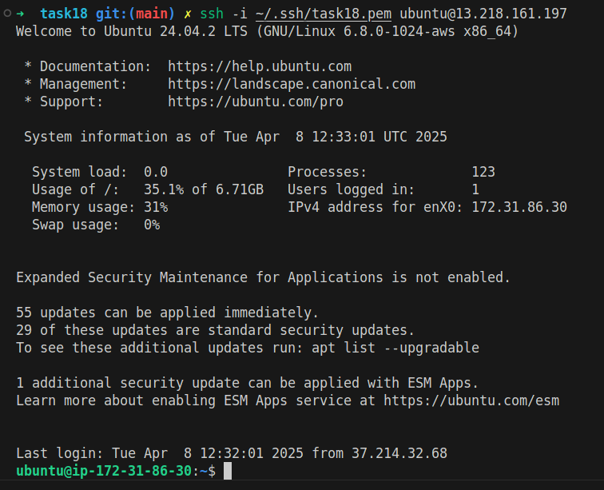
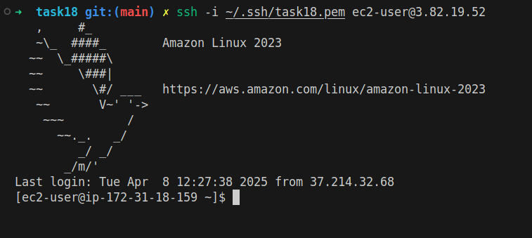

### На мастер машине создаю файл inventory в корне проекта.  Указываю public ip  инстансов, а также указываю путь на ssh key и имя пользователя для ssh.
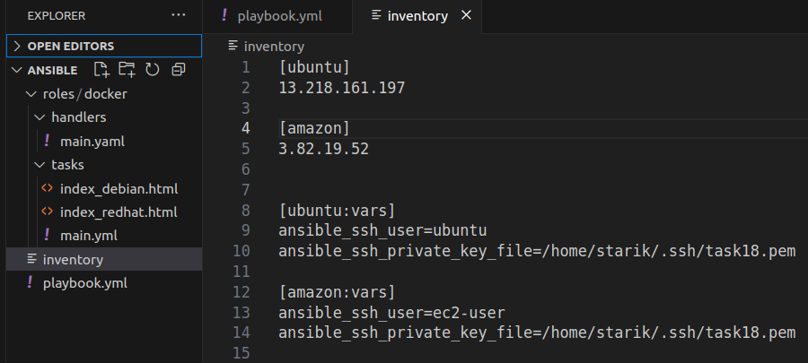

## [inventory](ansible/inventory)

### Создаю дерево папок для roles
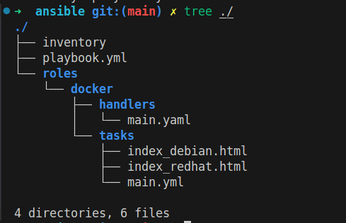

### Папка roles включает только одну роль - docker. Роль докер имеет папки handlers и tasks. Папка handlers включает main.yml в котором описываются ansible handlers. 
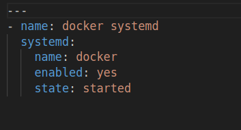

## [/docker/handlers/main.yml](ansible/roles/docker/handlers/main.yml)

### Хандлер "docker systemd" вызывается в папке docker/tasks в main.yml 
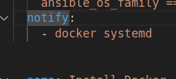

### В папке docker/tasks  в main.yml описываются ansible tasks
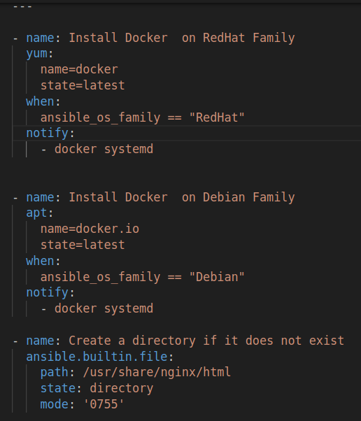

## [/docker/tasks/main.yml](ansible/roles/docker/tasks/main.yml)

### Таски из docker/task/main.yml вызываются в playbook.yml при вызове roles
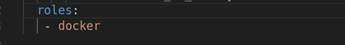

## [playbook.yml](ansible/playbook.yml)

### Чтобы выполнить playbook вызываю команду:  *ansible-playbook -i inventory playbook.yml*

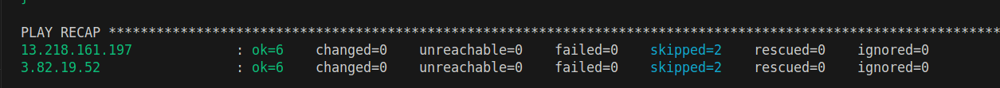

### В зависимости от ansible_os_family установка docker выполняется либо с помощью yum либо с помощью apt. Также в зависимости от ansible_os_family на сервер копируется либо index_debian.html либо index_redhat.html. Таски по запуск докер контейнера и созданию папки на сервере не зависят от типа операционной системы.

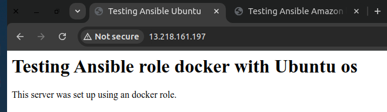

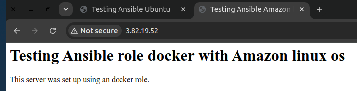