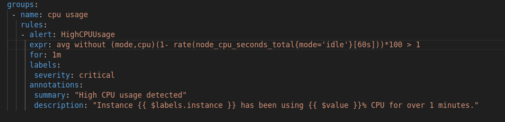

Задача №22 Поднять в композе Прометеус / нод-экспортер / алертменаджер. Написать алерт для прометеуса по cpu. И вывод будет производиться в слак или телеграмм на выбор. 2 дня

### Создаю docker-compose.yml. Файл включает три сервиса prometeus, node_exporter и alert_manager. По именам сервисов к ним можно будет обратиться в дальнейшем так как они находяться в сети prometheus_net типа bridge с возможностью DNS resolution.

## [docker-compose.yml](docker-compose.yml)

### Папки prometheus_volume и alertmanager_volume служат для размещения в них конфигурационных файлов прометеуса и алертманаджера.

### В папке prometheus_volume создаю файл конфигурации prometheus.yml. Указываю в нем alertmanager который будет собирать алерты, файл с правила rule.yml для инициации алерта, путь к targets node_exporter, который собирает метрики. 

## [prometheus.yml](./prometheus_volume/prometheus.yml)

### В rule.yml определено провило HighCPUUsage, алерт срабатывает если значение больше 1% в течении 1 минуты

## [rules.yml](./prometheus_volume/rules.yml)

### В файле alertmanager_volume/alertmanager.yml определен receiver которому алертманаджер отправляет сооющения

## [alertmanager.yml](./alertmanager_volume/alertmanager.yml)

### Web интерфейсы Prometheus, Alertmanager и Node Exporter

