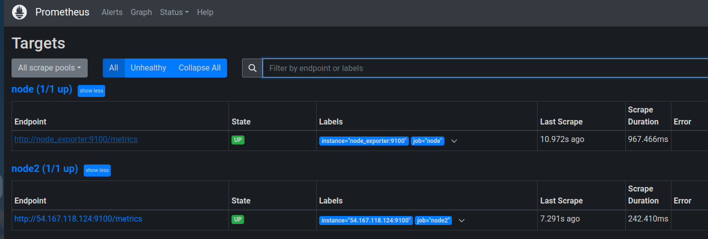
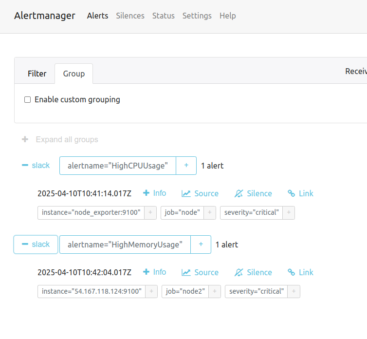

Задача №20 Второй таск. Поднять ещё один инстанс. Туда подключить экспортер с помощью docker или docker-compose. В прометеусе сделать задачи по лейблам алерта. СPU с одного инстанса, оперативка чекается с другого инстанса. Алерты в слак. (1 день)

### Создаю инстанс в EC2 

### На инстансе создают docker-compose.yml и запускаю в нем node_exporter

### В файле конфигурации prometheus.yml добавляю новый job 

## [prometheus.yml ](./prometheus_volume/prometheus.yml )
### В файле конфигурации rules.yml добавляю новый alert HighMemoryUsage

## [rules.yml ](./prometheus_volume/rules.yml )

### Правило HighMemoryUsage проверяет память на job='node2', тоеть только на новом инстансе

### В файле конфигурации alertmanager.yml  настраиваю оповещения в slack 

## [alertmanager.yml ](./alertmanager_volume/alertmanager.yml )

### Интерфейс prometeus где можно отладить условия на алерты
