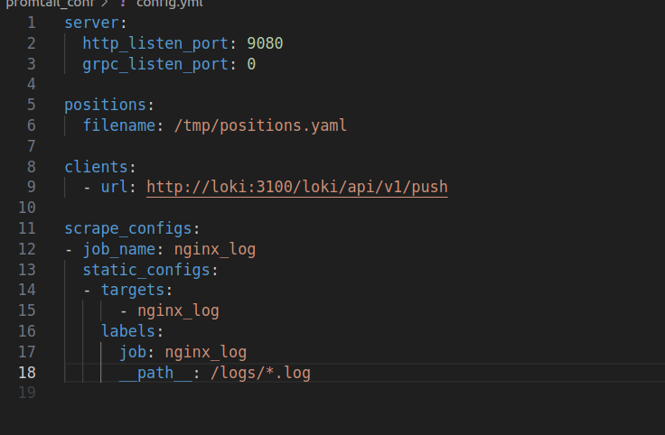

Задача №21 Третий таск. Поднять в композде локи/промтейл Настроить вывод логов с nginx. Прочитать логи (можно через графану например). Делать отдельнно от преведущих задач - 1день

### Создаю docker-compose.yml для сервисов loki и promtail

## [docker-compose.yml](docker-compose.yml)

### В volumes:loki  сервис loki хранит свои рабочие файлы

###  Cервис promtail получает доступ к логам nginx через  монтирование - /var/log/nginx:/logs

### В папках loki_conf promtail_conf храняться файлы конфигурации для сервисов.

## [./loki_conf/local-config.yaml](./loki_conf/local-config.yaml)

## [./promtail_conf/config.yaml](./promtail_conf/config.yml)

### Запускаю docker-compose.yml и проверяю сервисы

### Подключаю источник данных loki в Grafana

### Создаю дашборд и читаю данные от loki

### Данные можно выбирать как по job так и по имени файла или имени сервиса

