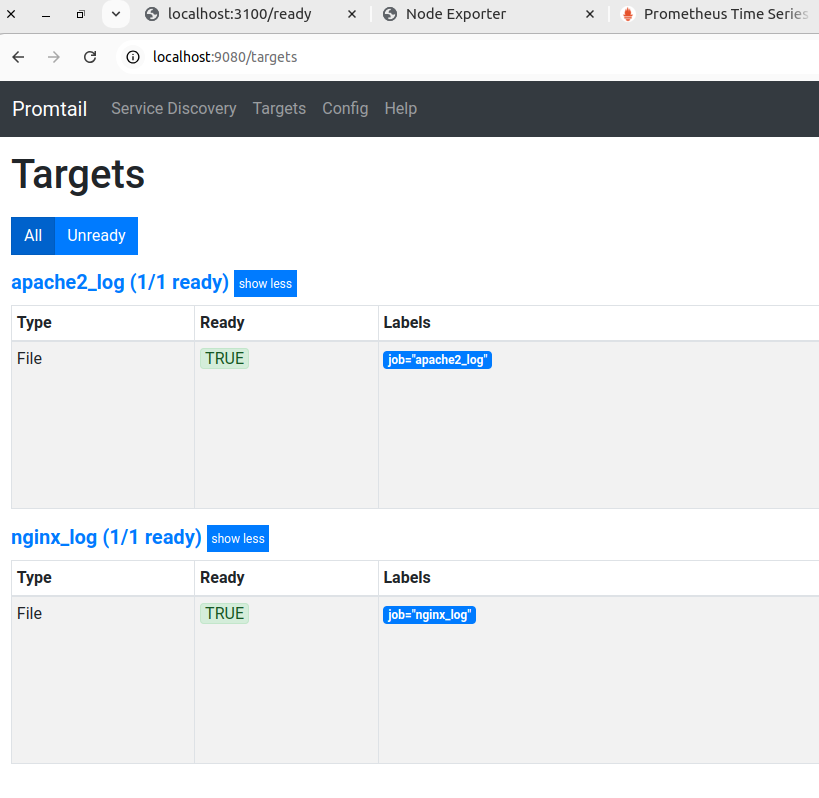

"Задача №22 Четвёртый таск. Поднять графану /Прометеус / нод-экспортер / локи/промтейл Законектить Прометеус и локи в графану . Настроить дашборты по cpu и оперативы.
 Настроить дашборт по логам nginx и апатч. Настроить нотификацию в слак через графану. Делать через docker-compose. 2 дня"

### Создаю docker-compose.yml для сервисов

## [docker-compose.yml](./docker-compose.yml)

### Создаю дополнительную виртуальную машину для на которой будет мониториться оперативная память и запускаю на ней node_exporter

### Так как оповещение о алертах будет выполнятся через grafana убираю из конфигурации prometheus.yml  указание на alertmanager и меняю ip адрес для node2  

## [./prometheus_volume/prometeus.yml](./prometheus_volume/prometheus.yml)

### В файл конфурации config.yml для сервиса promtail добавляю job apache2_log для чтения логов apache2

## [./promtail_conf/config.yml](./promtail_conf/config.yml)

### В grafana добавляю data source для loki и prometheus

### Настраиваю contact point для slack

### Cоздаю алерты для CPU и Memory

### Создаю дашборды для мониторинга CPU, Memory, логов nginx и apache2

