"Задача  №23 Подними Jenkins на отдельном пользователе ""Jenkins"" в Linux сделай CI CD процесс для солюшена с докером . Т.е ты должен внести коммит в гит, должен сработать вебхук который запустит дженкинс , сбилдятся докерфайлы , загрузится на реджистри , всё задеплоится на инстансы . И это должно работать по бесконечному циклу 

т.е надо задуматься об обновлении имейджей, а так же есть косяки с переполнением места который надо сразу продумывать

твоё приложение это будет твой веб только он будет крутиться в докере  (Дедлайн 4 дня )
+ сделать диаграмму c AWS и деплоем в draw.io"
NEW

### Создаю отдельного пользователь jenkins в на локальной машине устанавливаю java и уставливаю jenkins программу

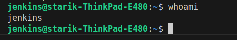

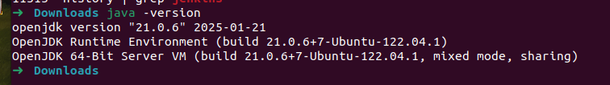

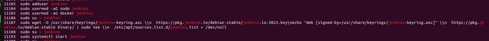

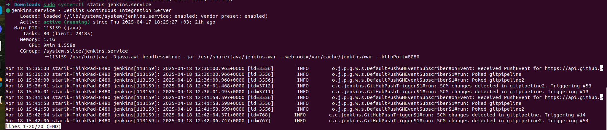

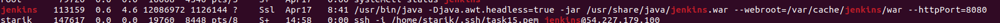

### Создаю новый item типа pipeline

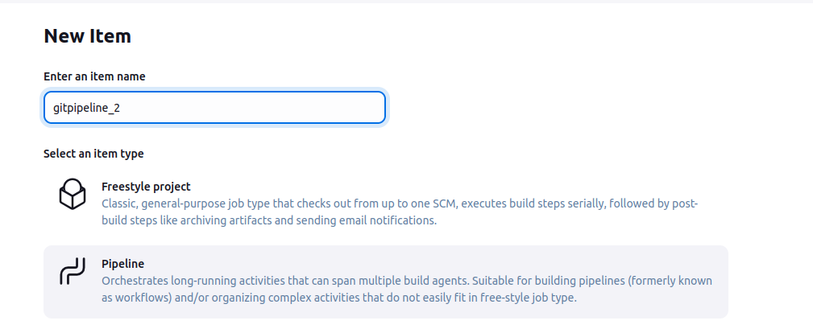

### Указываю репозиторий на github и тип триггера 

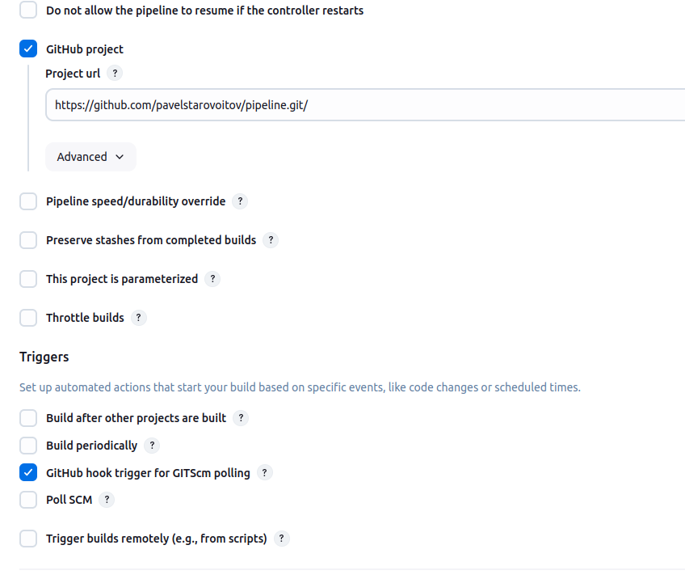

### Указываю расположение Jenkinsfile в том же репозитории на github.

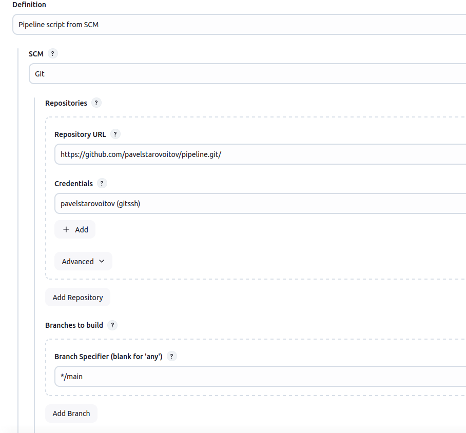

### Для github указываю ssh key

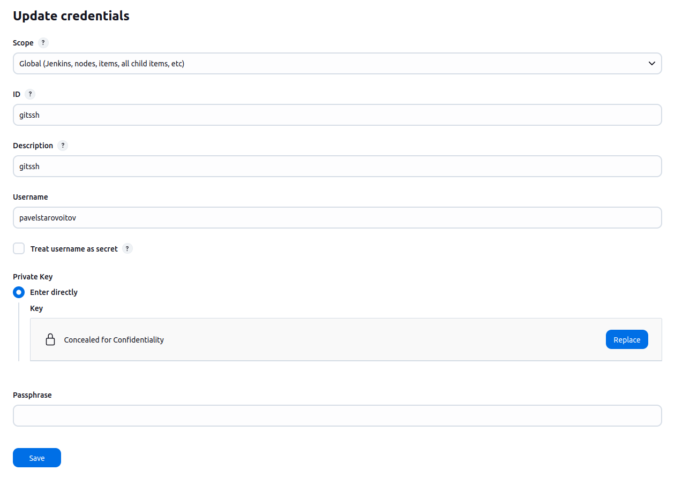

### Для dockerhub указываю login and password

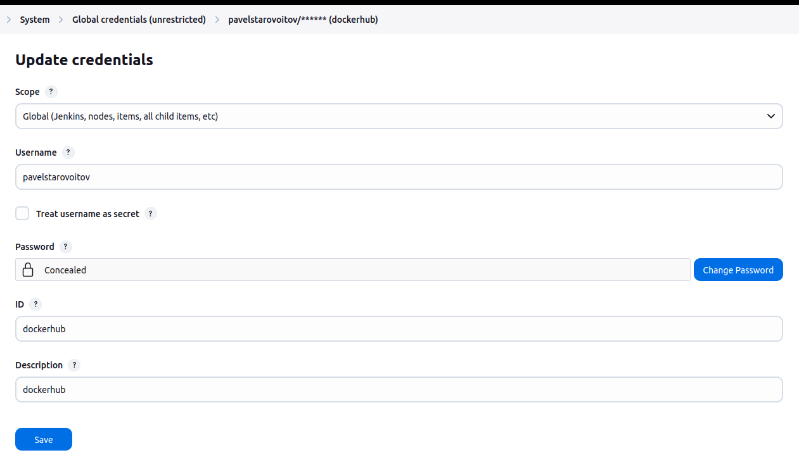

### Создаю EC2 инстанс на нем создаю пользователя jenkins, уснавливаю docker, java. Добавлюя инстанс в качестве worker для jenkins

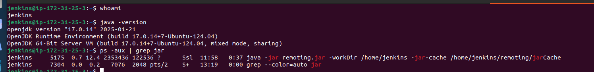

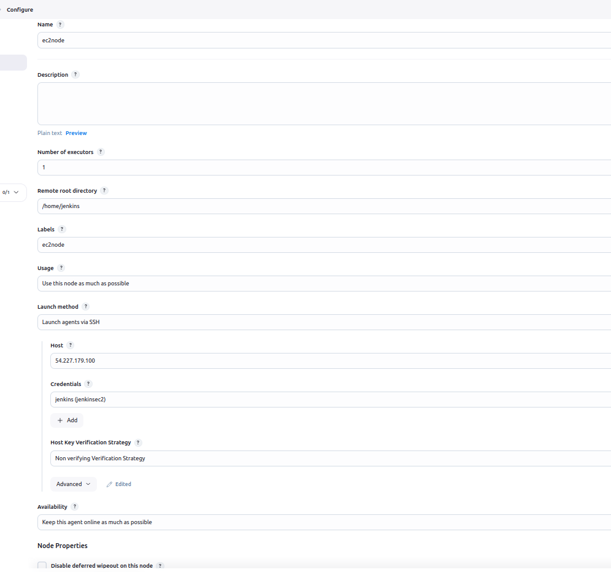

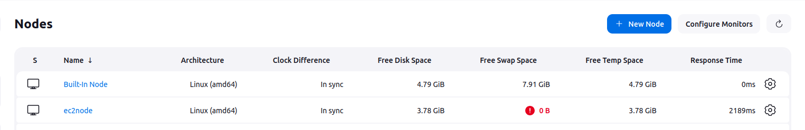

### Создаю Webhook на github

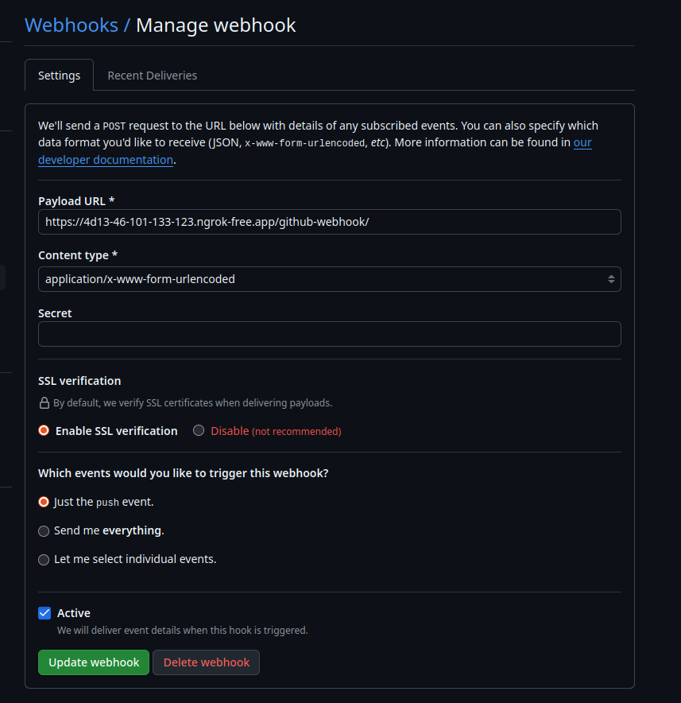

### Создаю Jenkinsfile

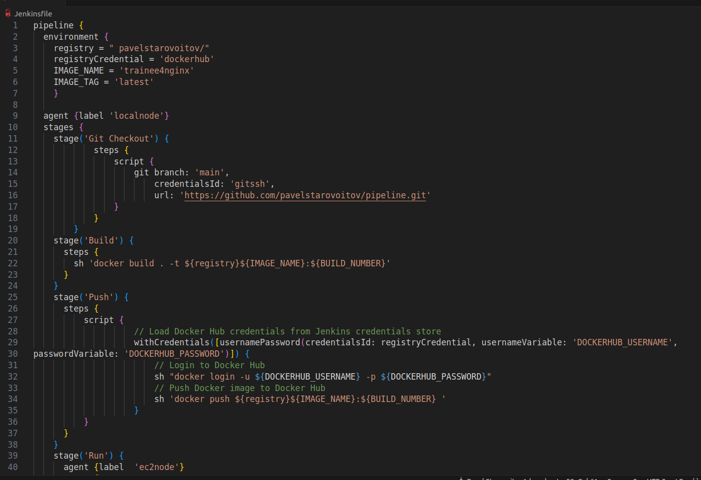

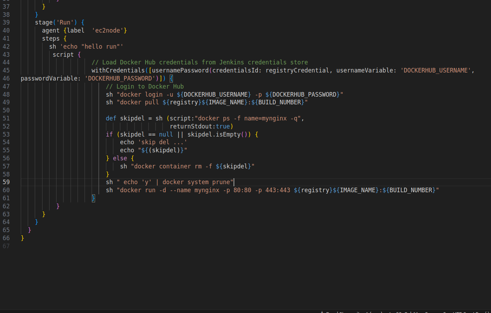

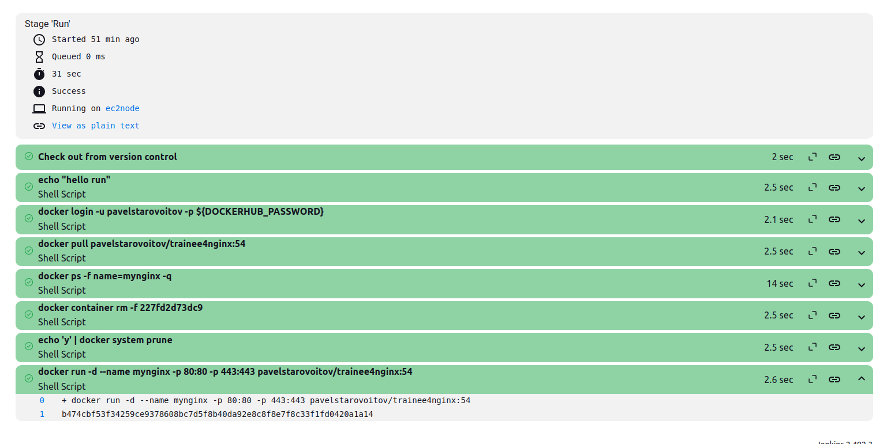

### надо задуматься об обновлении имейджей, а так же есть косяки с переполнением места который надо сразу продумывать
### Чтобы освобождать место использую команду: *sh " echo 'y' | docker system prune"*

## [Jenkinsfile](Jenkinsfile)

### + сделать диаграмму c AWS и деплоем в draw.io"

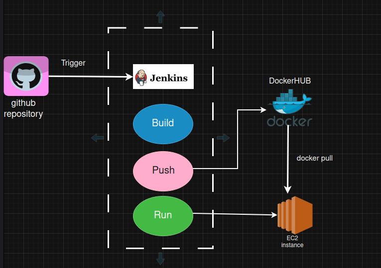

