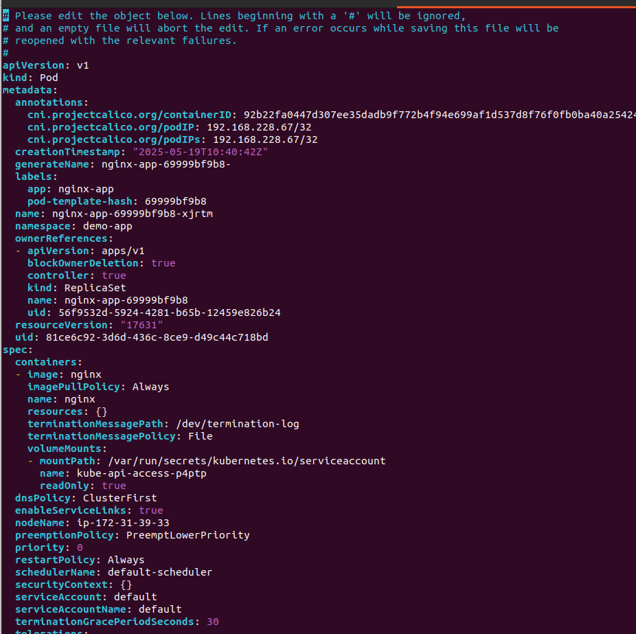

Задача №25 Раскатить kubeadmin на сервере + запустить под nginx и достучаться до него (3 дня)

## На каждой из node:

### Отключаю swap 

### Включаю модули ядра
 

### Включаю ip forward 

### Применяю изменения

### Устанавливаю containerd 

### Устанавливаю  kubelet, kubeadm, kubectl

## На control panel node:

### Иницилизирую control panel кластера 

### Создаю конфиг файл кластера

### Устнавливаю CNI calico

## На worker node:

### Добавляю worker node к кластеру 

## На control panel node:

### Создаю namespace для приложений 

### Создаю deployment c nginx

# [deployment.yaml](deployment.yaml)

# [pod.yaml](pod.yaml)

### Создаю service типа NodePort для ngix-app deployment

# [service.yaml](service.yaml)

