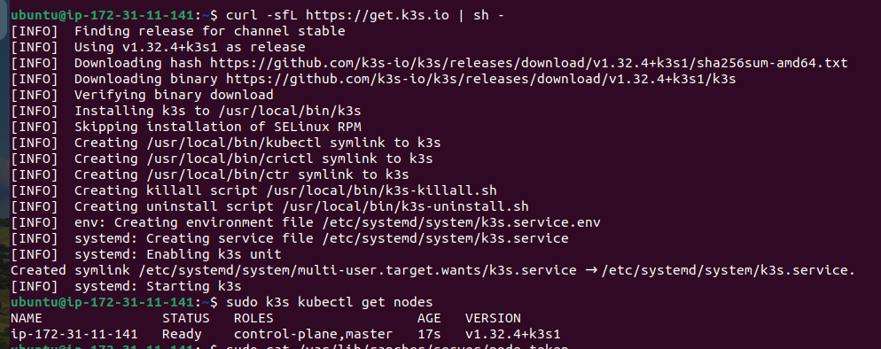
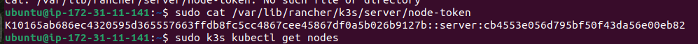
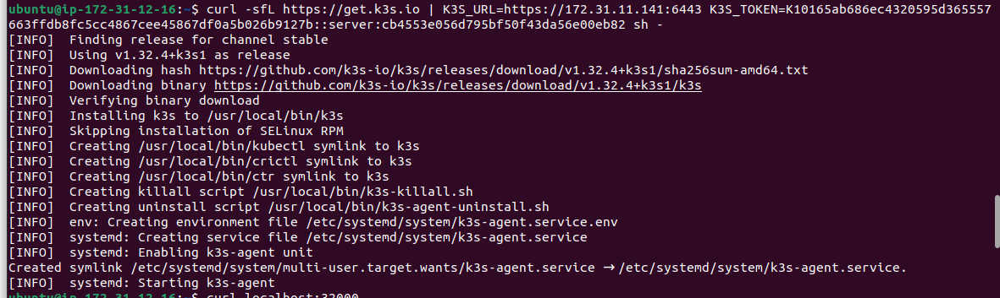
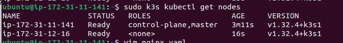
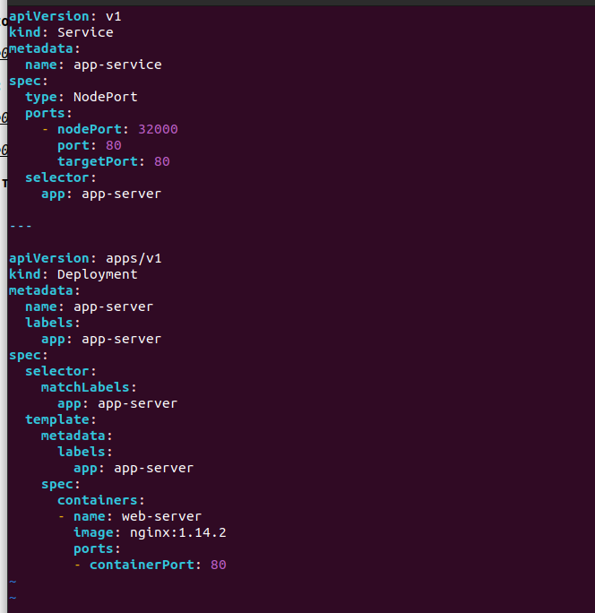
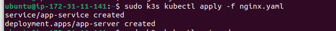
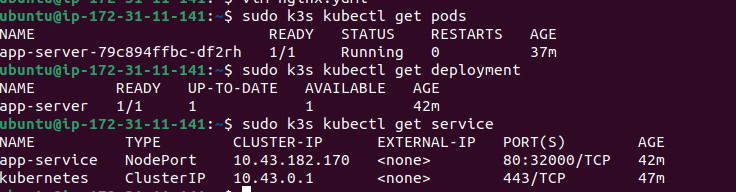
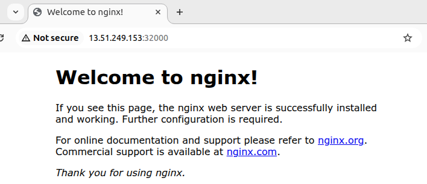

Задача N25* Раскатить кластер куба через k3s.Прочитать документацию k3s и знать разницу Deckhouse (3 дня)

### Уставливаю k3s на master node.

### Получаю node token 

### Зная ip адрес macter node и node token, добавляю к кластеру worker node

### Создаю сервис типа NodePort и Deployment для nginx

## [nginx.yaml](nginx.yaml)

