Задача N26 Раскатить кластер куба через Kubespray, вывести информацию по доступным нодам, создать 3 namespace(test, dev, prod). Задеплоить микросервис(в вашем случае nginx) с помощью Kustomize для трех окружений( показать на главной старнице к какому окружению вы стучитесь) (5 дней)

# Создаю инстанс на котором будет работать ansible и уставливаю необходимые компоненты

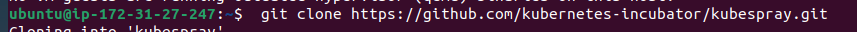

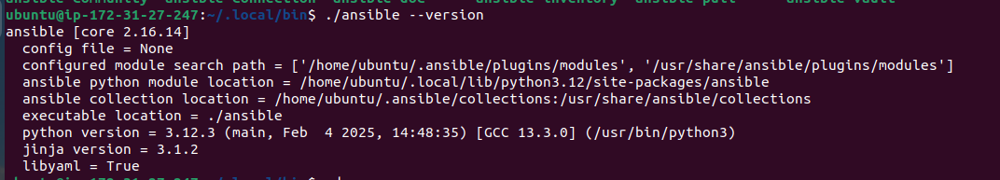

# Копирую папку с темплайтами в папку mycluster

# В папке mycluster редоктирую файл inverntory.ini, добовляя в него ip адреса control plane и worker кластера. 
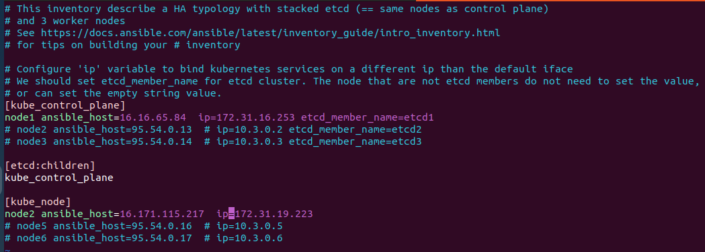
## [inventory.ini](inventory.ini)

# Запускаю playbook на создание кластера
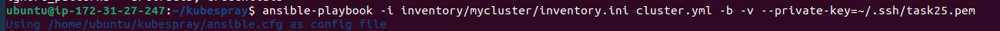

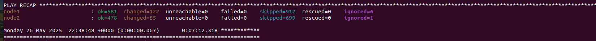
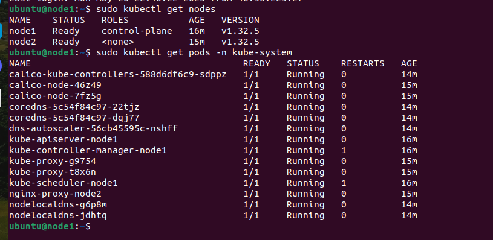
# Информация по нодам 
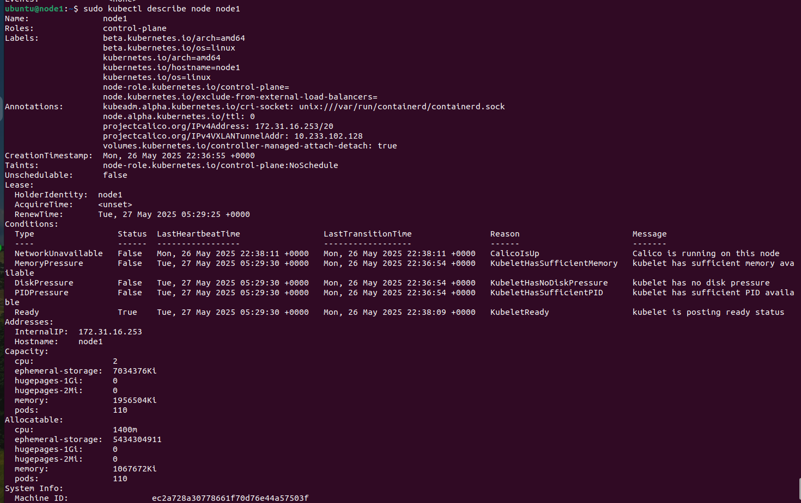
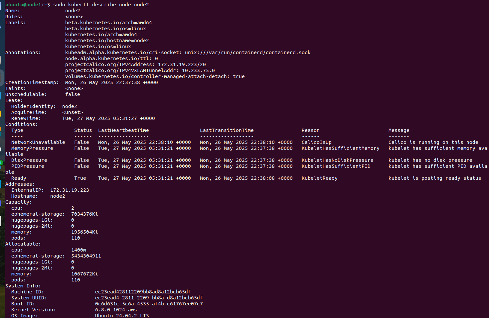

# Создаю test, dev, prod namespaces
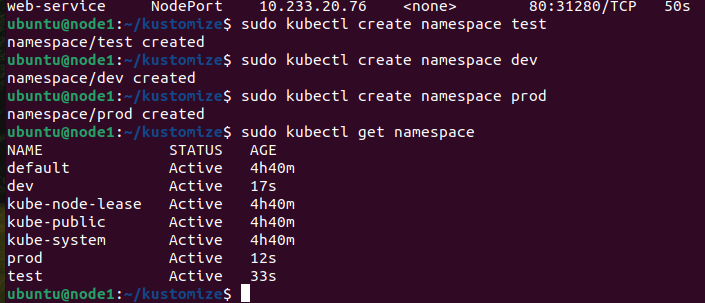

# Check kustomize
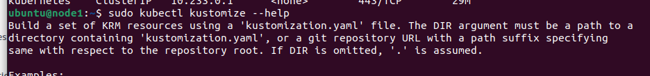

# Создаю дерево папок для kustomize

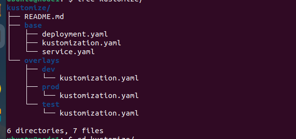
### [kustomize/base/deployment.yaml](kustomize/base/deployment.yaml)

### [kustomize/base/service.yaml](kustomize/base/service.yaml)

### [kustomize/base/kustomization.yaml](kustomize/base/kustomization.yaml)

### [kustomize/overlays/test/kustomization.yaml](kustomize/overlays/test/kustomization.yaml)

### [kustomize/overlays/dev/kustomization.yaml](kustomize/overlays/dev/kustomization.yaml)

### [kustomize/overlays/prod/kustomization.yaml](kustomize/overlays/prod/kustomization.yaml)

# Применяю изменения через kustomize

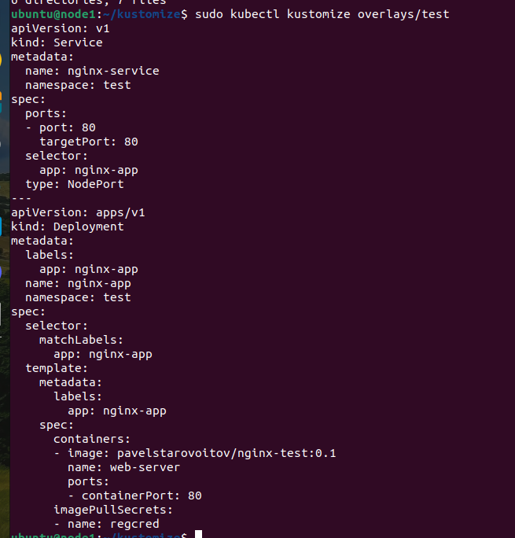
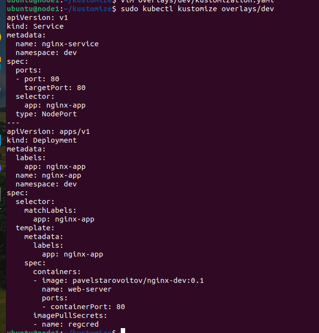
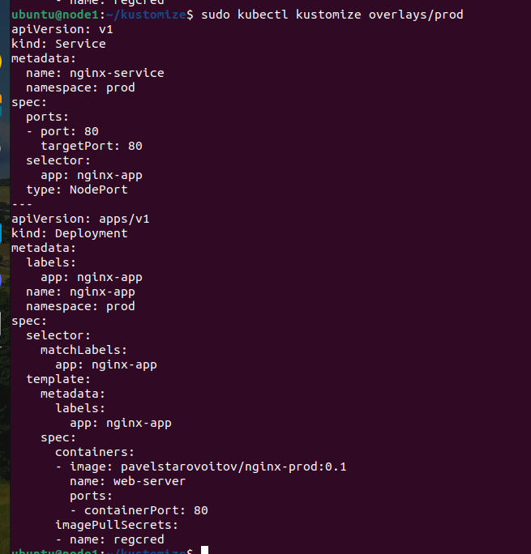

# Разворачиваю измененные .yaml файлы
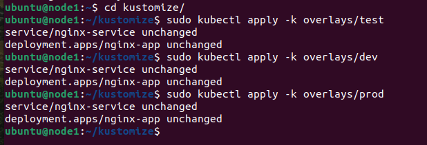

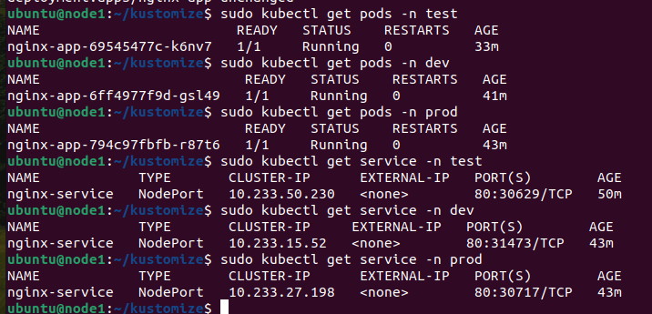
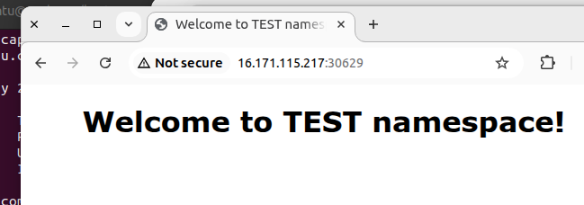
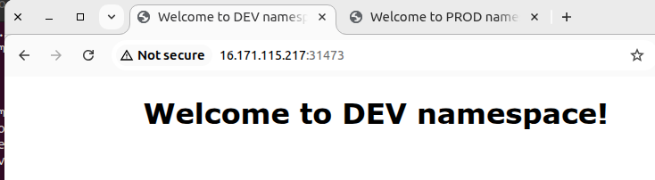
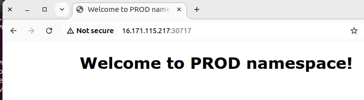
