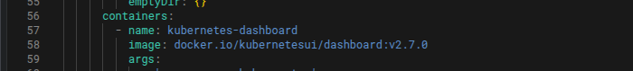
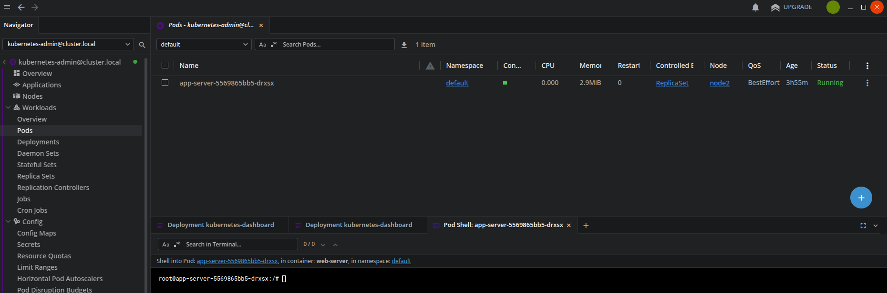

"Задача N26* Добавить к предыдущей задаче установку metrics-server + развернуть в кластере Kubernetes Dashboard. Обратить внимание на версию Kubernetes и его поддерживаемую версию со стороны Kubernetes Dashboard. Посмотреть, что он из себя представляет. 
Установить себе на локальную машину Kubernetes Lens IDE, подключить свой кластер Kubernetes, и также посмотреть, что из себя представляет приложение
. (2 дня)"

### В файле /home/ubuntu/kubespray/inventory/mycluster/group_vars/k8s_cluster/addons.yml делаю доступными для установки dashboard и mertrics_server. Меняю порт с 10250 на 4443, так как 10250 испозльуется kubelet

## [addons.yml](addons.yml)

### Редактирую Service дашборда с ClusterIP на NodePort

#### Создаю ServiceAccount для просмотра дашборда

## [kubernetes-dashboard-admin-user.yml](kubernetes-dashboard-admin-user.yml)

#### Создаю token

### Обратить внимание на версию Kubernetes и его поддерживаемую версию со стороны Kubernetes Dashboard. 

### Версия кластера 1.32.5 

### Версия dashboard 2.7.0

### Посмотреть, что он из себя представляет. 

### Действия доспутные пользoвателю определяются исходя из RBAC  пользователя. В общем случае доступен следующий функционал:
### Dashboard позволяет просматривать сущность кластер, позволяет изменять просматриваеный namespace

### Позволяет подключатся к поду черес команду exec

### Позволяет просматривать логи пода

### Позволяет редактировать  сущности кластера

### Установить себе на локальную машину Kubernetes Lens IDE, подключить свой кластер Kubernetes, и также посмотреть, что из себя представляет приложение

### Копирую конфиг файл кластера с control-plane ноды на локальную машину

### Добавляю файл конфигурации кластера в Lens

### Указываю публичный ip адрес control-plane ноды в конфиг файле кластера

### Делаю Port Forwarding на контрол ноде

### Lens отображает сущности кластера 

### В Lens можно просматривать иcпользавание ресурсов кластером, редактировать сущности кластера, просматривать логи, подключаться к подам. 

