Задача №27 Перенести всю структуру с докера на куб,а конфиг через конфиг мап. + добавить liness,readness, startup probe(Дедлайн 4 дня). 

### Разворачиваю кластер с помощью kubespray. В addons.yml выбираю metallb и ingress для установки

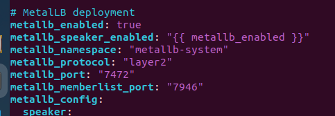

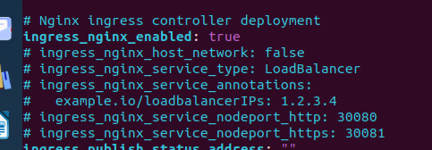

### В k8s-cluster.yml указываю kube_proxy_strict_arp: true для metallb

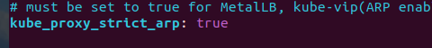

### В  addons.yml указываю local_volume_provisioner_enabled: true для монтирования configmap

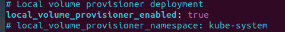

### В inventory.ini указываю ip адреса нодов

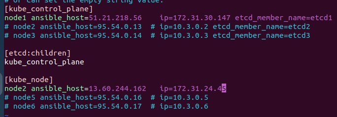

#### Запускаю ansible-playbook и разворачию кластер

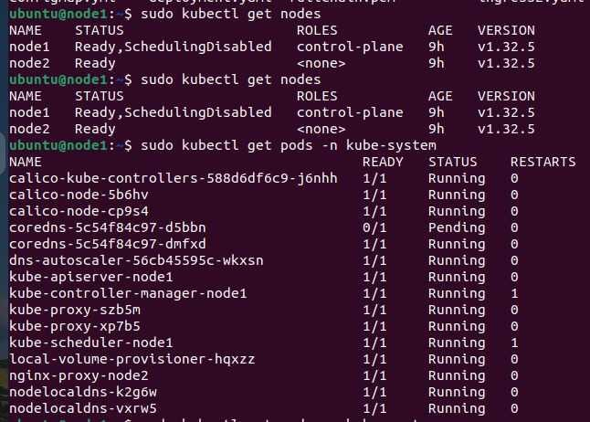

#### Добавляю IPAddressPool для metallb

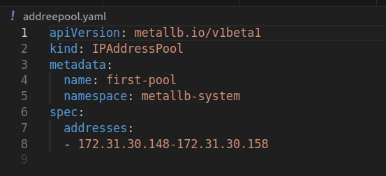

## [addresspool.yaml](addresspool.yaml)

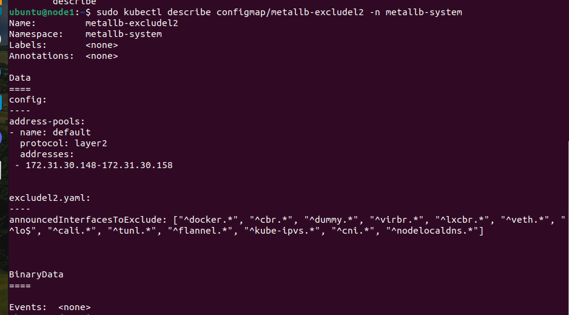

### Создаю секрет для докер registry 

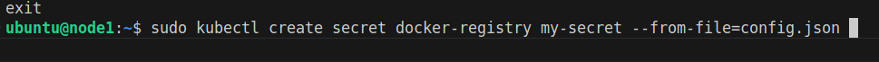

### Создаю секрет для ingress использую ssl сертификат и ключ
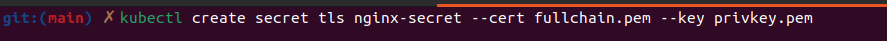

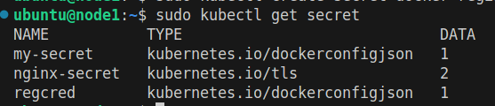

### Создаю configmap для nginx.conf и index.html файлов

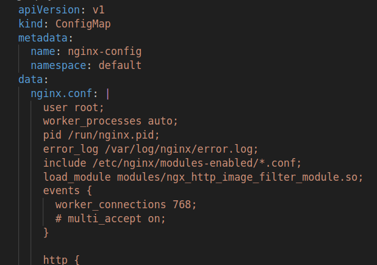

## [configmap2.yml](configmap2.yaml)

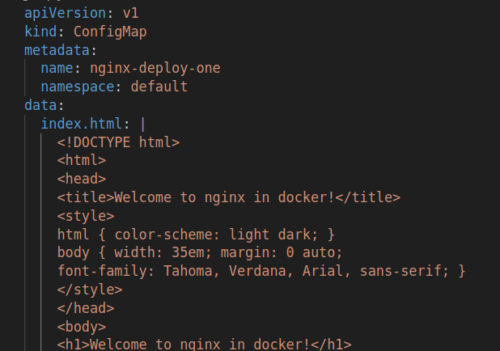

## [configmap.yml](configmap.yml)

### Создаю deployment nginx

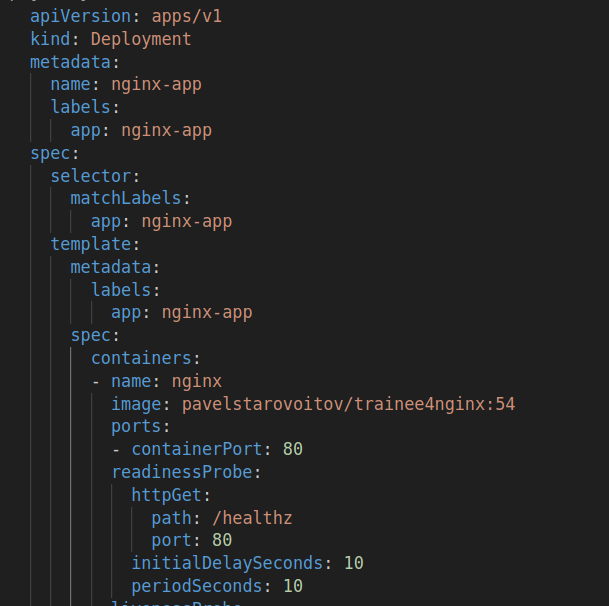

## [deployment.yaml](deployment.yaml)

### В deployment указываю volumeMounts для configmap и readiness, liveness, starup Probes
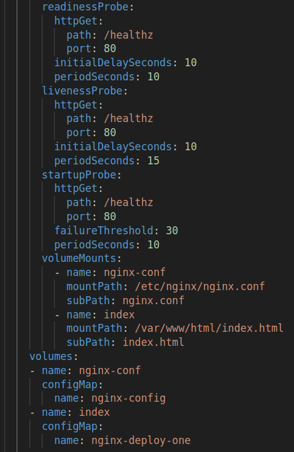

### Для probes создаю location в nginx.conf

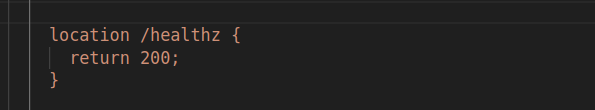

### Создаю ingress для https трафика

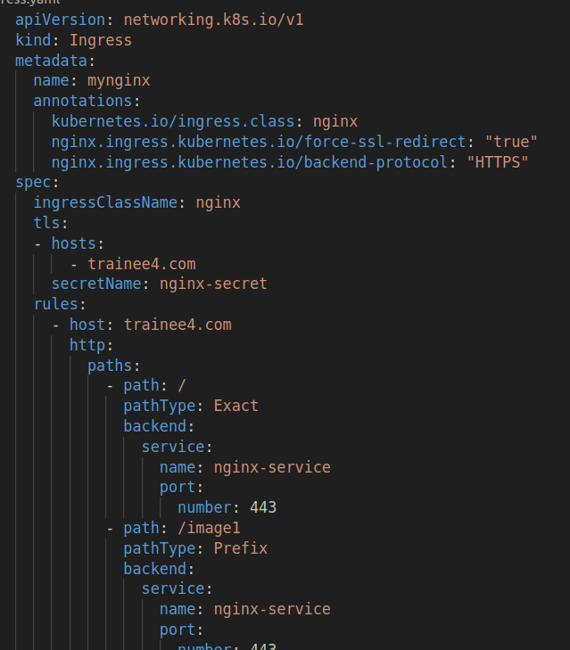

## [ingress.yaml](ingress.yaml)

### Создаю nginx-service типа LoadBalancer

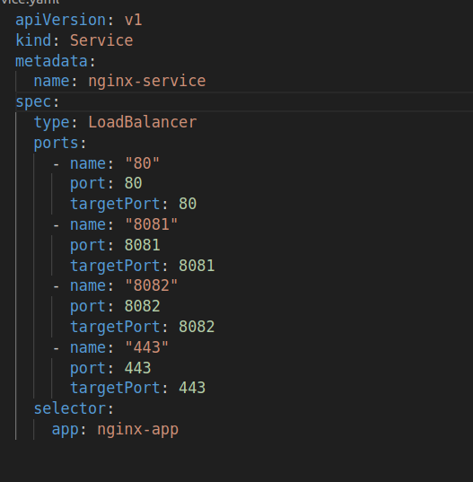

## [service.yaml](service.yaml)

### Создаю ingress для http трафика

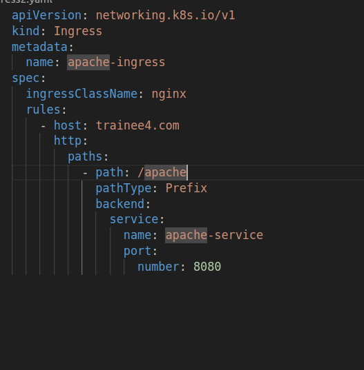

## [ingress2.yaml](ingress2.yaml)

###  Создаю deployment для  apache

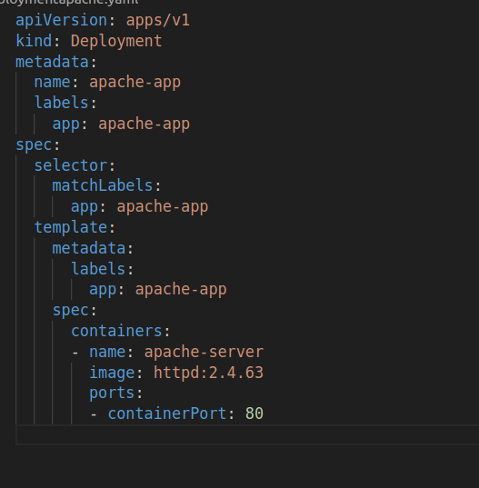

## [deploymentapache.yaml](deploymentapache.yaml)

###  Создаю service для  apache

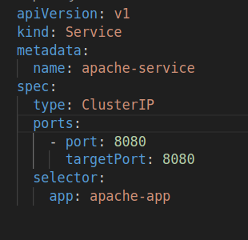

## [serviceapache.yaml](serviceapache.yaml)

### Проверяю запущенные ресурсы

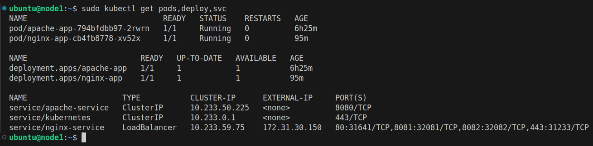

### Обновляю DNS записи 

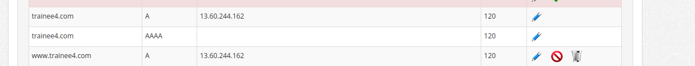

### Проверяю работу

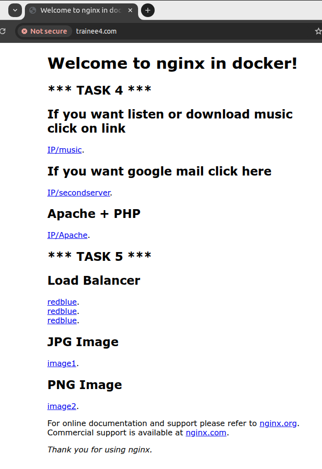

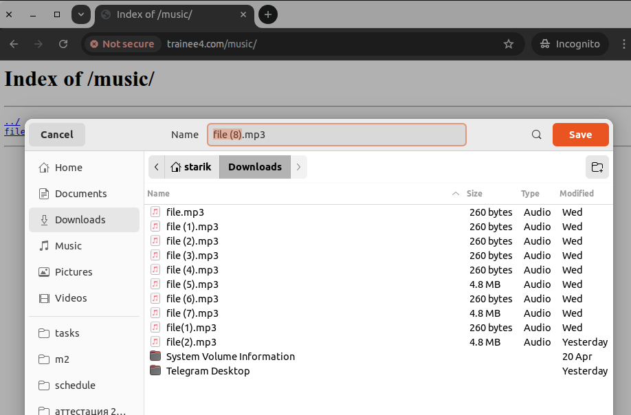

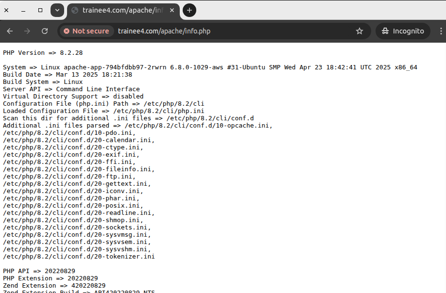

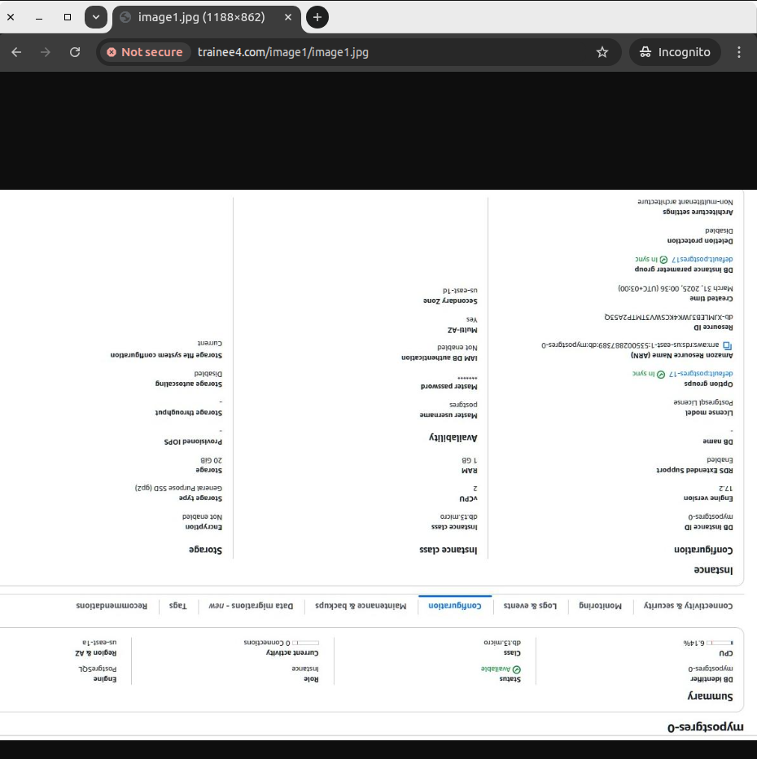

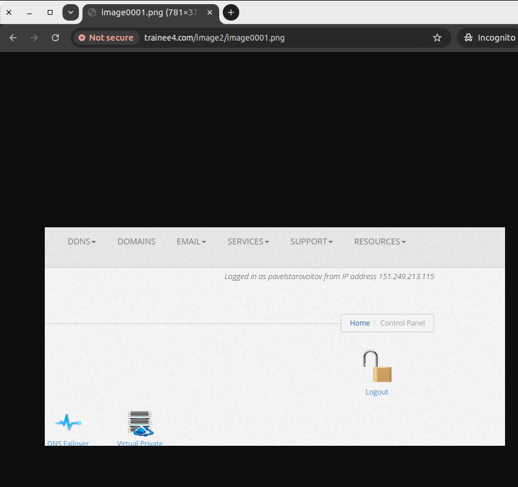

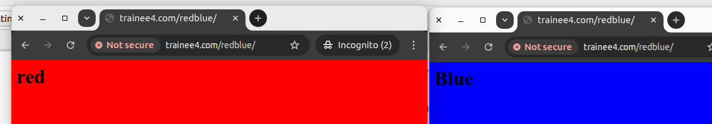

### Прверяю ответ /healthz  для probes

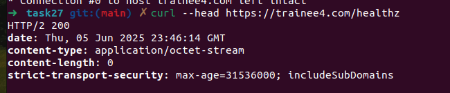

