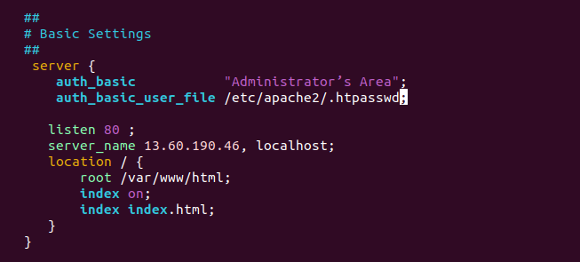
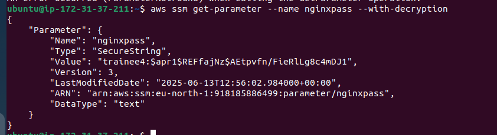

Задача №29 Сделать http basic аутентификацию в nginx с хранением логина и пароля в ssm parameter store (1 день)

### Для создание логина и пароля устанaвливаю утилиту htpasswd

### Создаю логин и пароль в файле .htpasswd

### В nginx.conf указываю необходимость аутентификации

### Создаю секрет с логином и паролем  в ssm parameter store 

### Секрет можно получить с помощью aws cli 

### Удаляю файл .htpasswd где хранится логин и пароль и пересоздаю его из секрета ssm parameter store

