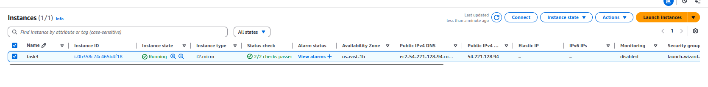
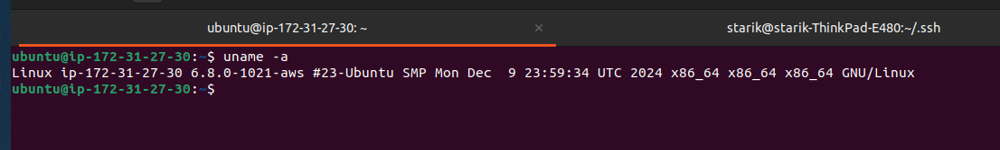
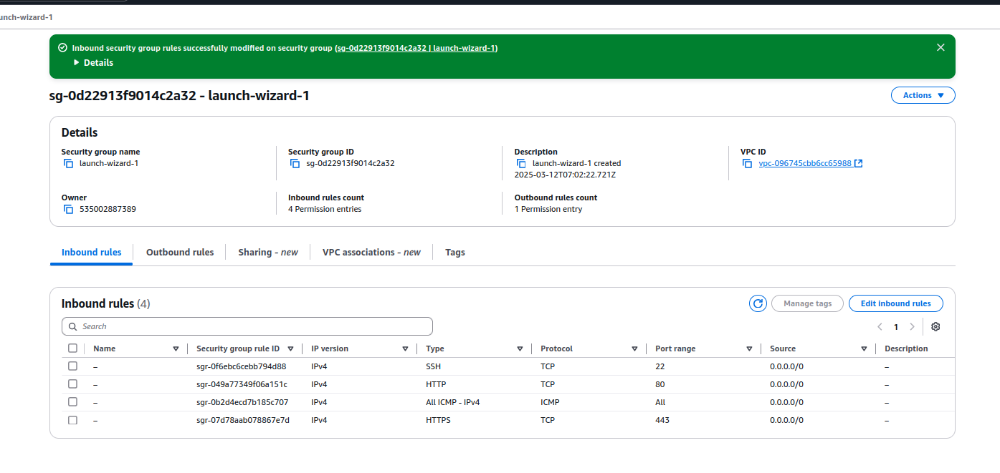
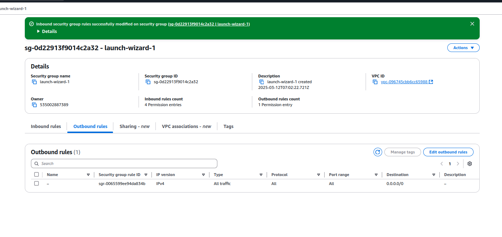
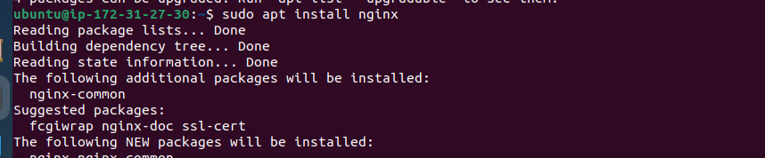
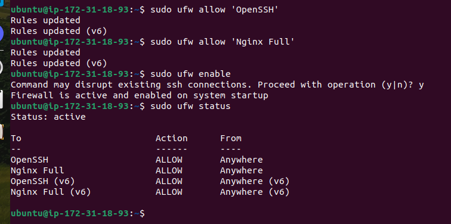
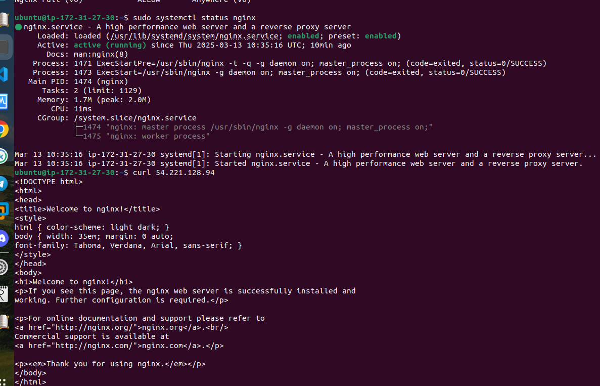

### Задача №3 

 1. В EC2 установить free-tire ubuntu и накатить на неё NGINX
 2. Создать репозиторий на GitHub для дальнейшей работы(сохранение всех конфигов nginx, docker и тд...) (Дедлайн 1 день) 

### Создание free-tire ubuntu

### Конфигурация Inbound Outbound правил в Security Groups

### Установка Nginx

sudo apt get update 

sudo apt install nginx

### Настройка фаервола ufw

sudo ufw app list

sudo ufw allow 'Nginx Full'

sudo ufw enable

sudo ufw status

### Проверка nginx

sudo systemctl status nginx

curl 54.221.128.94

