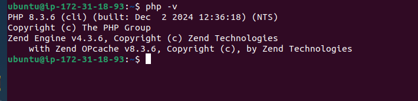
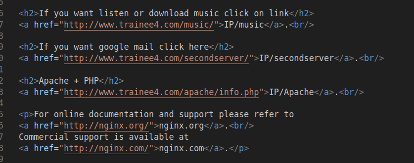

"Задача №4 Nginx + Apache + PHP + SSL

Нужно реализовать обратный прокси на базе NGINX, который будет проксировать запросы: 
•что-то на локальную машину
•что-то на другой порт
•что-то на другой сервер.

1.Зарегистрируйся на сайте: https://www.dynu.com/
2.Разобраться в типах днс записей, и сделать днс запись типа А, для своего тестового сервера.
3.Затем используй 2 метода получения сертификатов для nginx.
4.Добавить редирект с 80 на 443 порт для всех подключений (cайт должен работать только по HTTPS).

В помощь:
Letsencrypt
webroot

Концепция такая:
Я стучусь на сервер (NGINX) по 80 порту и должен видеть описание, что-то типа:
•Если вы хотите попасть на страницу с контентом 1, то нажмите сюда (и мы попадаем на другую страничку, которую обрабатывает этот же NGINX просто по другому порту или днс имени).
•Если вы хотите скачать файл с музыкой нажмите сюда и по ссылке ты качаешь mp3. (IP/music)
•Если нужен сервер, работающий на Apache+PHP нажмите сюда и по ссылке отдаётся информация о PHP сервере (IP/info.php)
•Если вы хотите получить респонс с другого сервера жмите сюда и тут ты видишь уже сайт который отдается не проксёй, а другим сервером (IP/secondserver)
(4 дней)"

### Зарегистрируйся на сайте: https://www.dynu.com/

### Разобраться в типах днс записей, и сделать днс запись типа А, для своего тестового сервера.

### Затем используй 2 метода получения сертификатов для nginx

### Первый метод. Letsencrypt с использованием certbot
 
 sudo apt install certbot

 sudo apt install python3-certbot-nginx

 sudo certbot certonly --nginx -d trainee4.com
 
 sudo certbot certonly --nginx -d www.trainee4.com

### Второй метод. Сомоподписанный сертификат, использую openssl

sudo openssl req -x509 -nodes -days 365 -newkey rsa:2048 -keyout /etc/ssl/private/nginx-selfsigned.key -out /etc/ssl/certs/nginx-selfsigned.crt

### Добавить редирект с 80 на 443 порт для всех подключений (cайт должен работать только по HTTPS).

### Установка Apache и PHP

sudo apt install apache2

sudo apt install php libapache2-mod-php 

### Настройка location 

## [nginx.conf](nginx.conf)

## [index.html](index.html)

## [Cсылка на сайт](https://trainee4.com)

