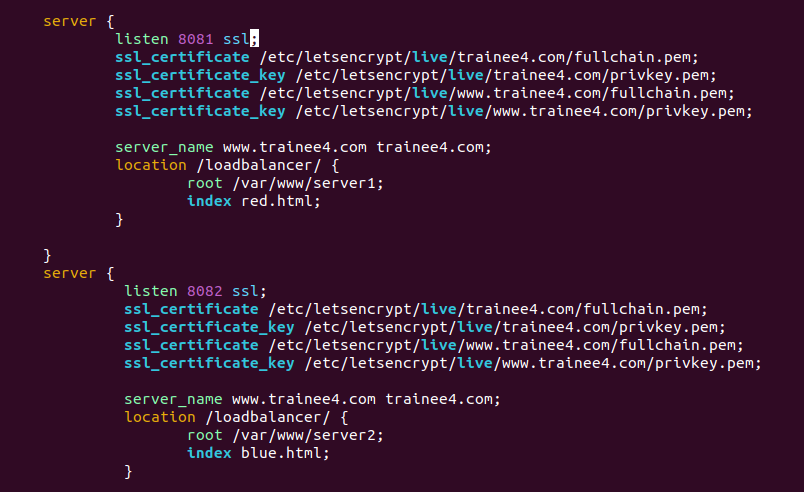
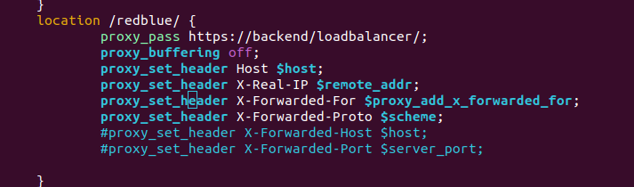
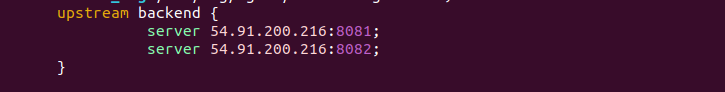
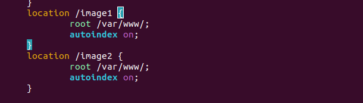
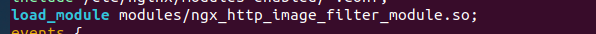
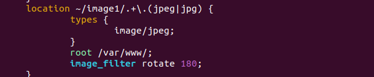
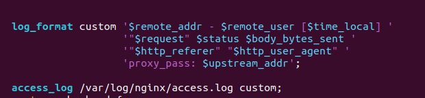
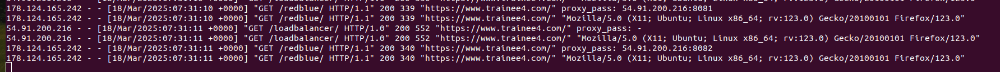
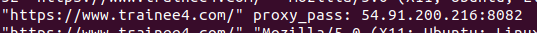

"Задача №5 Nginx header + proxy + upsteram + regex 

На основе прошлой задачи, нужно создать ещё два сервера, в nginx и сделать переход по /redblue и что бы:
1.после первого перехода на этот путь будет красная страница 
2.после второго перехода по этому адресу нужно получить синюю страницу. 
(для этого задействовать балансировку и проксирование.)

• нужно создать переход на /image1 там будет jpg и /image2 где будет png. 
•+ Сделать регулярное выражение для картинок. Если формат jpg, то картинка будет перевёрнута с помощью nginx.
•при выводе логов, показать куда проксировал запрос клиента.
(3 дня)"

### На основе прошлой задачи, нужно создать ещё два сервера, в nginx и сделать переход по /redblue и что бы:
### 1.после первого перехода на этот путь будет красная страница 
### 2.после второго перехода по этому адресу нужно получить синюю страницу. 
### (для этого задействовать балансировку и проксирование.)

***

### Создание двух дополнительных серверов в nginx 

***

### Проксирование и балансировка

#### По умолчание ngix использует метод Round Robin, то есть поочередно отправляет запрос на сервера указанные в upstream.

***

### нужно создать переход на /image1 там будет jpg и /image2 где будет png. 

### + Сделать регулярное выражение для картинок. Если формат jpg, то картинка будет перевёрнута с помощью nginx.

***

### при выводе логов, показать куда проксировал запрос клиента.

 ***
## [nginx.conf](nginx.conf)

## [index.html](index.html)

## [Cсылка на сайт](https://trainee4.com)

