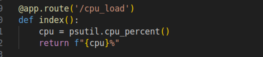
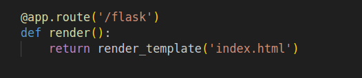
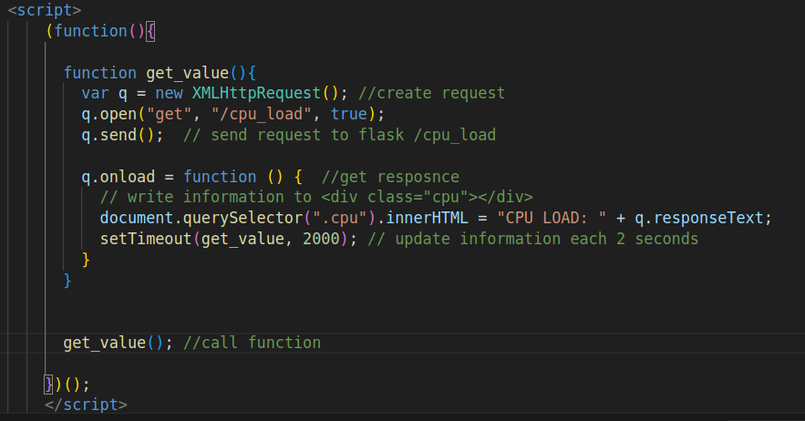
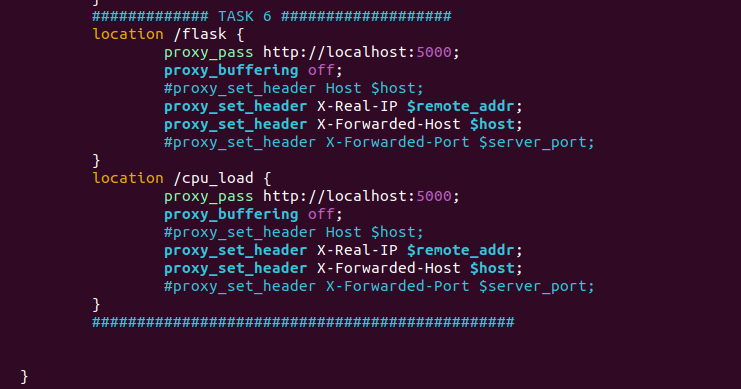
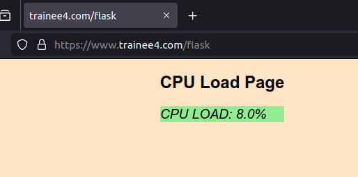
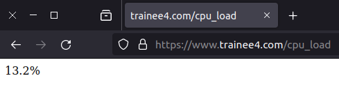

"Задача №6 Нужно вывести загрузку CPU на страничку NGINX в реалтайме, потом создать демон процесс который будет писать раз в 5 секунд в файл логи NGINX
(при попытке грохнуть процесс, он должен перезапускаться) 
Когда файл достигнет размера больше чем 300 кб ну может 500 , ( суть в некотором наполнении ) файл лога должен очищаться 
В 2 файле должна присутствовать лог об удачных очистках файла с логами NGINX с датой и временем очистки. 

В 3 файл надо складывать отдельно логи с 500 ошибками 
В 4 файл надо складывать логи с 400 ми ошибками 

Логи NGNIX можно сохранять любые до каких сможешь дотянуться 

Для парсинга логов использовать sed или awk

если файл будет наполняться слишком быстро, увеличь тригер очистки корневого лог файла до 1 мб до 3 пока не станет комфортно работать с другими заданиями (Дедлайн 3 дня)"
***

### Нужно вывести загрузку CPU на страничку NGINX в реалтайме

Чтобы получить инфорамцию о загрузке процессера использовал Python бибилотеку psutil

Использую фрейворк Flask создал route '/cpu_load' по которому возращается значение полученное от psutil

Созда route '/flask' для отрисовки html страницы

## [app.py](flask/app.py)

На html странице создал JavasSript функцию, которая обаращется к route '/cpu_load' каждые 2 секунды

## [index.html](flask/templates/index.html)

В nginx.conf добавил проксирование на flask routes '/flask' и '/cpu_load' 

## [nginx.conf](nginx.conf)

