"Задача №7  Создать 2 сервера, 1-ый паблик ( бастион хост) 2-ой сервер в приватке ( только приватный ИП, публичного нет) Скрипт , который при обращении на бастион
 Будет логиниться на приватный сервер и выполнять там команду апт гет апдейт ssh  . Также поставить варгард
 
уточнение по заданию:
у тебя на бастионе будет лежать скрипт, который я запущу по ссш, который выполнит команду ссш: подключись на приватный сервер и выполни ап апдейт (Дедлайн 3 дня)"
***
### Создаю VPC
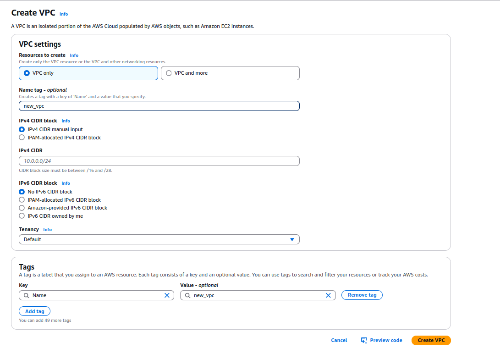

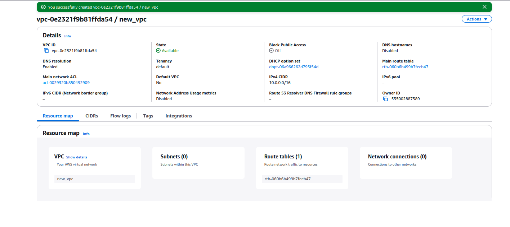

### В новой VPC создаю две subnet. Public subnet для бастион хост, private subnet для  приватного хоста

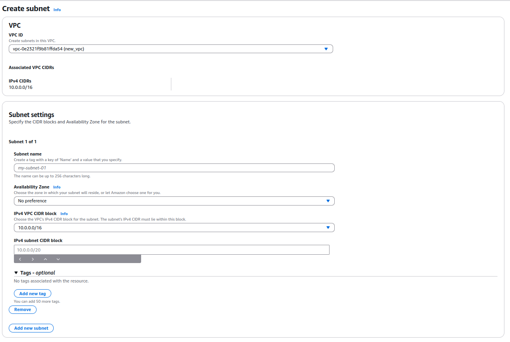

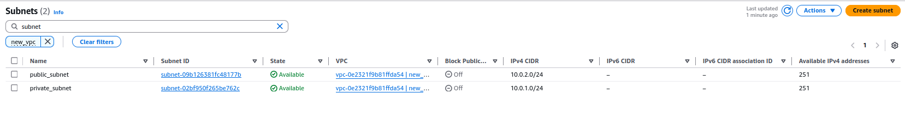

### Создаю route tables для public и private subnet

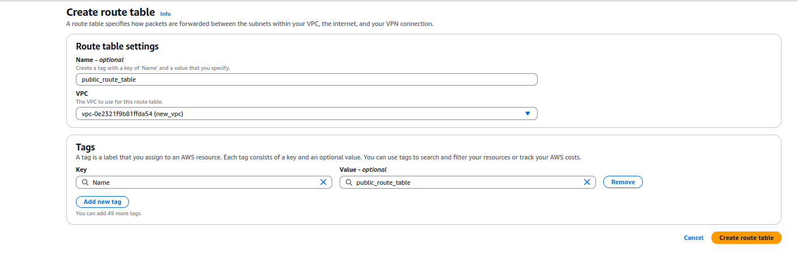

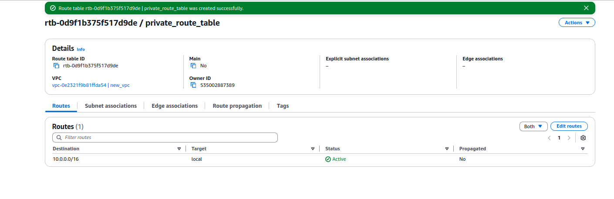

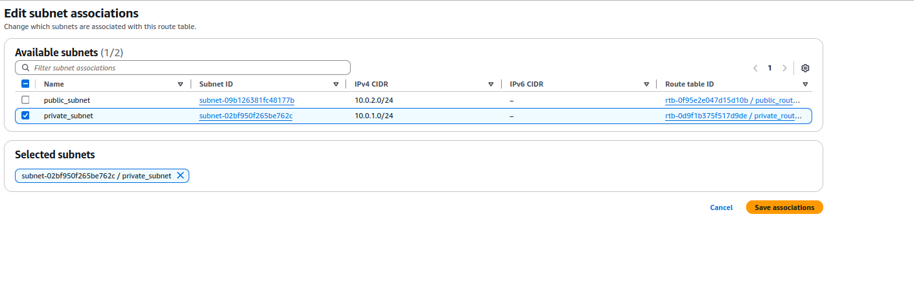

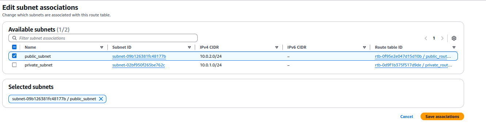
### Создаю internet gateway для public subnet

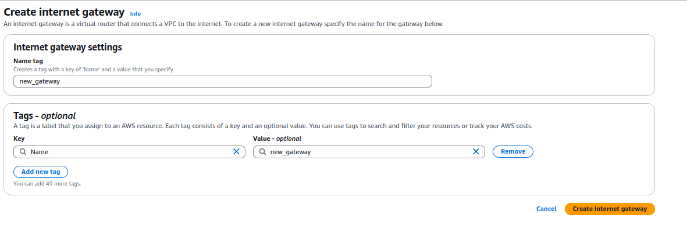

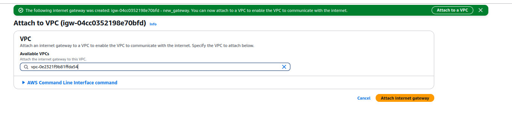

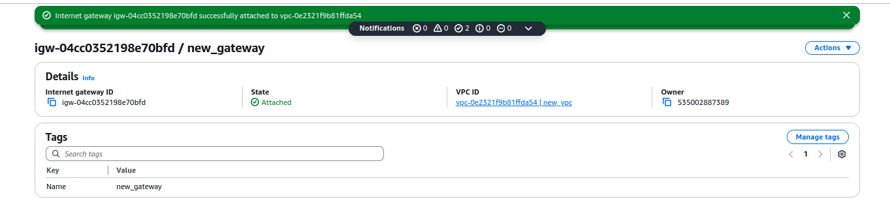
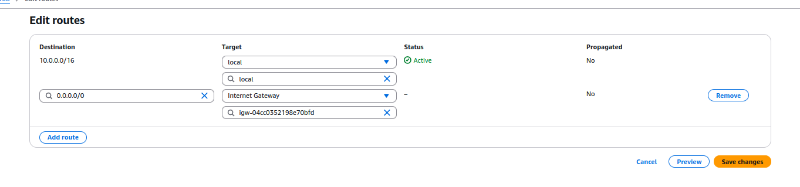

### Создаю NAT getway для private subnet

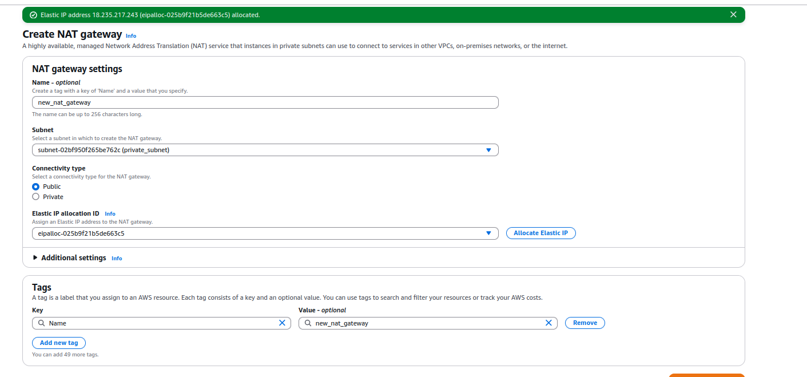

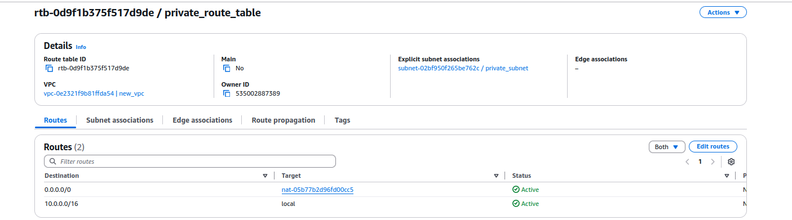

### VPC имееет public и private subnet. 
### Трафик из/в public subnet роутится через route table и Internet gateway
### Трафик из/в private subnet роутится через route table и NAT gateway
### 

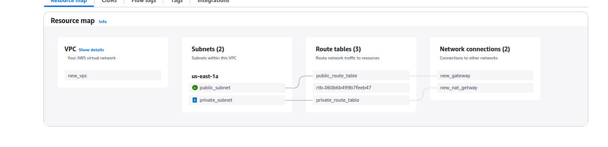
***
### Создаю бастион хост в public subnet

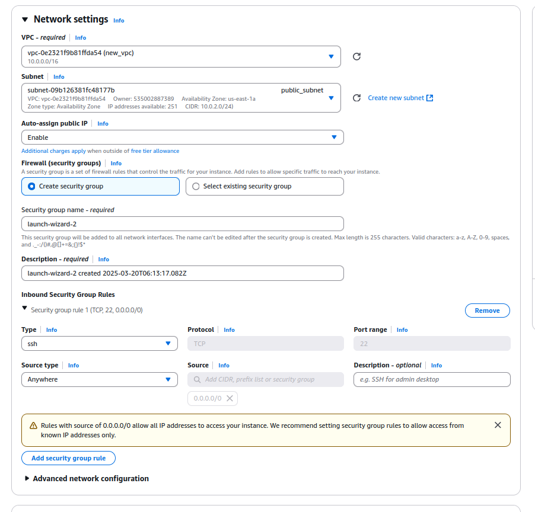

### Создаю приватный хост в private subnet

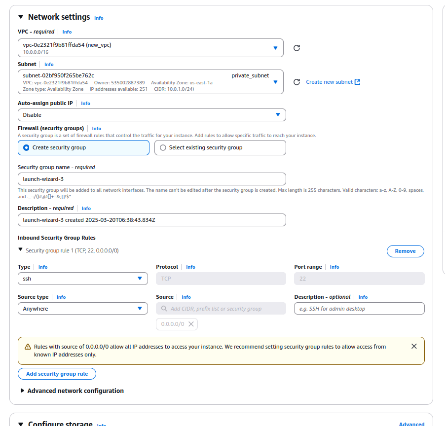

### Приватный хост не имеет public IP adress

***
### уточнение по заданию:
### у тебя на бастионе будет лежать скрипт, который я запущу по ссш, который выполнит команду ссш: подключись на приватный сервер и выполни ап апдейт 

### Подключаюсь к бастион хост по ssh 
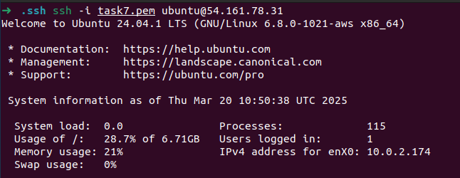

### На бастион хост создаю скрипт который будет поключаться к приватному хосту и выполнять update

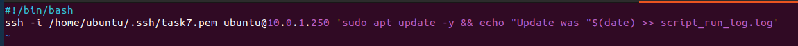

## [Файл Скрипта](update_script.sh)
### Команда ssh -i /home/ubuntu/.ssh/task7.pem ubuntu@10.0.1.250 выполняет подключение к приватному хосту
### 'sudo apt update -y && echo "Update was "$(date) >> script_run_log.log' выполняет обновление на приватном хосте и записывает дату и время выполнения в файл script_run_log.log

### Запускю скрипт на бастион хосте с локального компьютера

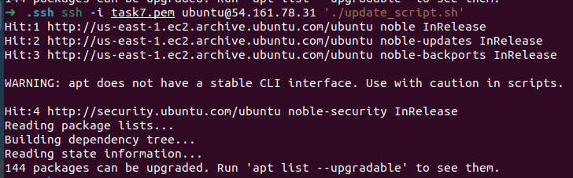

### Установка wireguard:

### На бастион хосте

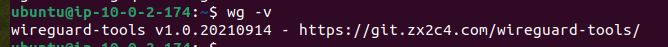

### На приватном хосте

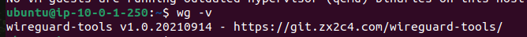

