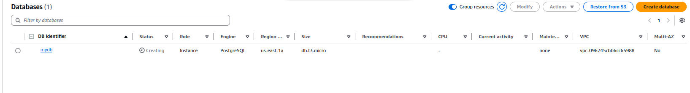

"Задача №8 про AWS RDS

Создать инстанс для базы данных типа postgres с именем cluster_jun. Подключится к ней через pgAdmin установленный на ПК и через командную строке терминала линукс через терминальный клиент psql. Cоздать в кластере баз данных postgres базу данных jun_db. Создать в ней таблицу под названием credit_cards_numbers. 

Руками сделать snapshot. Удалить базу данных. Восстановить её из snapshots. Проверить наличие созданной таблицы через pgAdmin и терминальный клиент psql.

Настроить её бэкапы через AWS Backup по расписанию раз в час например. Когда сделан автоматический backup удалить текущий кластер баз данных jun_db и восстановить его из бэкапа. Проверить наличие созданной таблицы credit_cards_numbers через pgAdmin и терминальный клиент psql. Дедлайн 2 дня"
NEW

***
### Создаю инстанс базы данных postgresql

#### Создаю Inbound rule для postrgesql порт 5432

### Устанавливаю psql на локальной машине и подключаюсть к postgres инстансу в AWS

### Устанавливаю pgAdmin4 на локальной машине и подключаюсть к postgres инстансу в AWS

### Cоздать в кластере баз данных postgres базу данных jun_db. Создать в ней таблицу под названием credit_cards_numbers. 

### Руками сделать snapshot. Удалить базу данных. Восстановить её из snapshots. Проверить наличие созданной таблицы через pgAdmin и терминальный клиент psql.

### Настроить её бэкапы через AWS Backup по расписанию раз в час например. Когда сделан автоматический backup удалить текущий кластер баз данных jun_db и восстановить его из бэкапа. Проверить наличие созданной таблицы credit_cards_numbers через pgAdmin и терминальный клиент psql.

