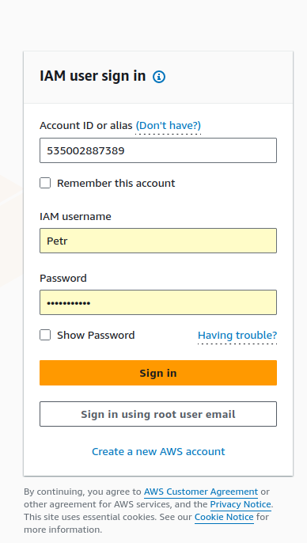

"Задача  №9 для IAM (И)

Часть 1
Создать EC2 инстанс и s3 bucket c именем mybucket. Сделать так чтоб доступ был к ведру mybucket был через IAM роль.
Когда вводим aws s3 ls мы должны увидеть список ведер
*Не пользуемся AWS configure и не делаем export переменных для кредов аккаунта AWS 

Часть 2
Создать в IAM пользователя Petr и предоставить емуConsole access. Cоздать группу just_users. Добавить пользователя в группу just_users. Дать 
права группе на только на полный доступ к EC2. Попробовать из этого пользователя Petr создать новый инстанс в любом регионе и создать vpc в любом 
регионе. Рассказать о результах

*Часть 1 и Часть 2 не связаны друг с другом
Дедлайн 3 дня"

### Часть 1

### Создаю Policy

## [Policy for S3 bucket](s3_policy.json)

### Создаю Role для EC2

### Создаю инстансе EC2 с ролью для просмотра S3 bucket

### Создаю S3 bucket

### Когда вводим aws s3 ls мы должны увидеть список ведер

***

### Часть 2

### Создать в IAM пользователя Petr и предоставить емуConsole access.

## [AmazonEC2FullAccess.json](AmazonEC2FullAccess.json)

### Попробовать из этого пользователя Petr создать новый инстанс в любом регионе и создать vpc в любом регионе. Рассказать о результах

### Пользователь Petr имеет возможность создовать инстансы EC2 и VPC, так как правило AmazonEC2FullAccess включает не только доступ к EC2, но и к другим сервисам 

